# 神经网络 (Neural networks)

## 神经网络的介绍

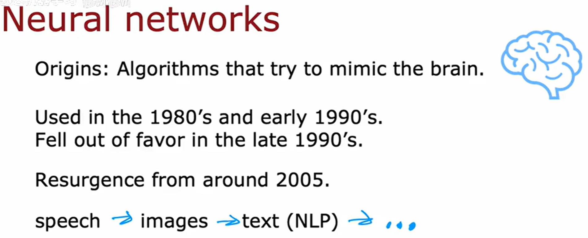

> NLP: Natural Language Processing

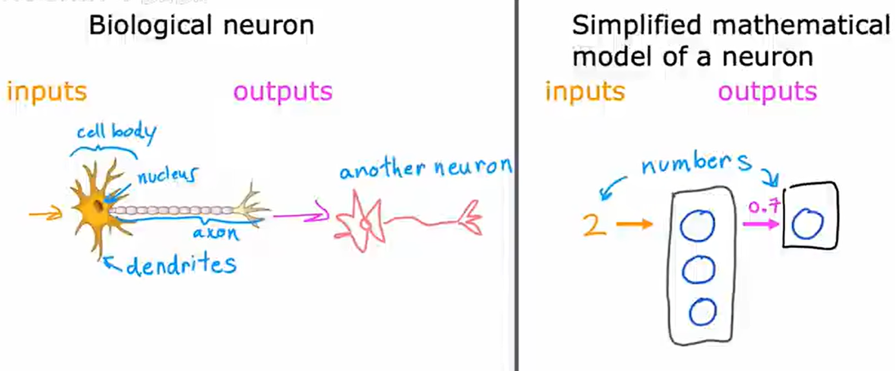

> 尽管初略将生物神经元和人工神经元进行类别，但如今对人脑如何工作还存疑问，因此盲目模仿人脑可能不会在构建真正的智能方面走得太远。即便是如此简化的神经元模型，依旧能够构建非常强大的深度学习算法。

Q: 为什么在过去几年里神经网络才真正的兴起？

【大数据量 + 高性能】

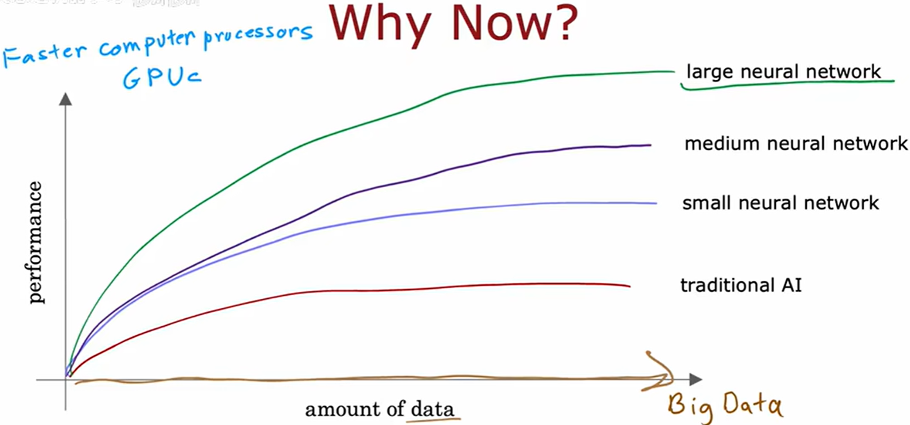

传统机器学习算法，例如逻辑回归和线性回归，即使给这些算法再多的数据，也很难让其性能不断提升。

**传统机器学习算法在数据扩展性（Scalability）方面存在固有局限性，无法像现代大规模机器学习方法（如深度学习或分布式算法）那样高效利用海量数据。**

**越大型的神经网络（参数量越多）通常具备越强的数据扩展性（Data Scalability）**

**训练更大型的神经网络需要更高的计算性能**

## 需求预测 (Demand Prediction)

> activation ——激活
>
> 神经学中，指的是一个神经元向下游的其他神经元发送高输出的程度

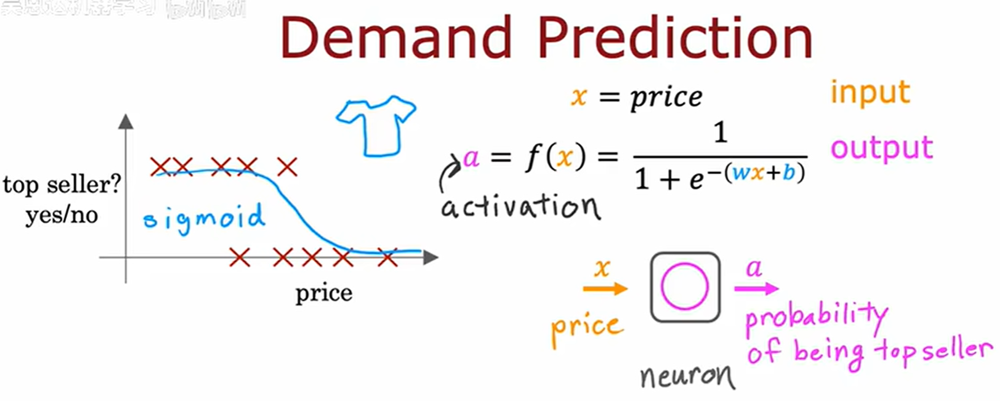

如图中的逻辑回归，可以作为大脑中单个神经元的简化模型。而构建神经网络只需要把这些神经元组合在一起。

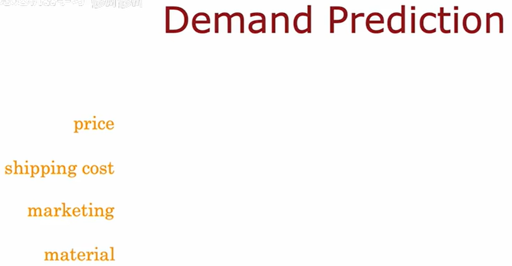

首先你拥有四个特征，价格、运费、销量、材料质量，而可能称为畅销品可能取决于如下几个因素。

* 价格实惠 (affordability)
* 认知度 (awarness)
*  感知质量 (perceived quality)

由此根据四个特征，构建神经元来对应几个因素，关系如下。

每个神经元都采用逻辑回归。

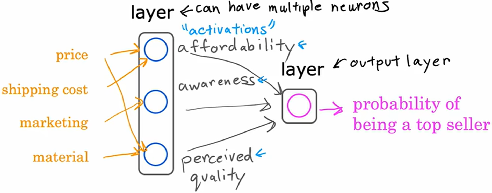

将左边三个神经元组合在一起，称之为层 (`layer`)；右边的一个神经元也是一层，称之为**输出层** **(output layer)**。

**层（Layer）是神经网络的组成单元，由一组神经元（Neurons）构成。每个神经元接收前一层输出的特征表示（通常以数值向量的形式），通过加权求和、非线性激活函数等运算，生成新的特征表示并传递到下一层。每一层的作用是对输入数据进行逐级抽象和变换，最终形成更高层次的语义特征。**

深度学习的核心优势之一在于其**多层（深层）架构**，这使得它能够通过**分层特征提取**和**组合**，从数据中学习到更复杂、更高维度的抽象表示，从而在许多任务上超越传统的单层机器学习模型。

图中的 `affordability` `awareness` `perceived quality` 也被称为激活值 (activation values)，这层三个神经元的激活，最后的输出层的输出概率也是最右侧神经元的激活值 (activation values)。

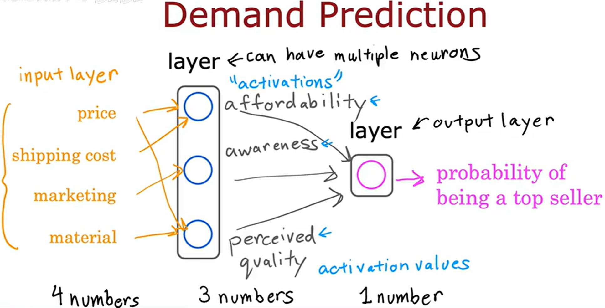

`price` `shipping cost` `marketing` `material` 这四个数据的列表也成为**输入层 (input layer)**。

截止学习的目前，构造神经网络必须逐个神经元地决定它从上一层获取哪些输入，但是如果在构建一个大型的神经网络，逐个手动决定哪些神经元应该以哪些特征作为输入将会是很大的工作。

实际上的神经网络，每个神经元将可以访问每一个特征，每个上一层的值，如下图。

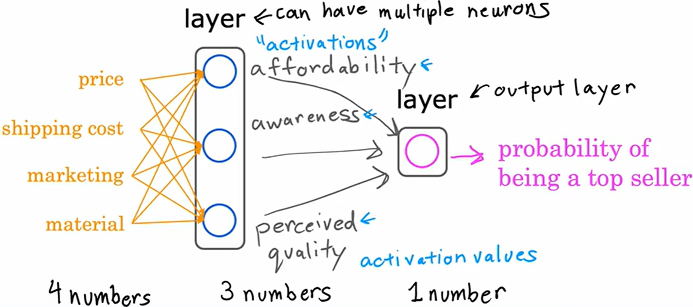

通过改变权值来专注于相关的特征子集（就像前面学习的正则化那样）。

输入层和输出层的中间一层被称为**隐藏层 (hidden layer)**。因为在训练集中，可以容易观察到 $(x, y)$ 训练样本的正确值，但是不会给出如图中 `affordability` `awareness` `perceived quality` 的正确值，故称为隐藏层。

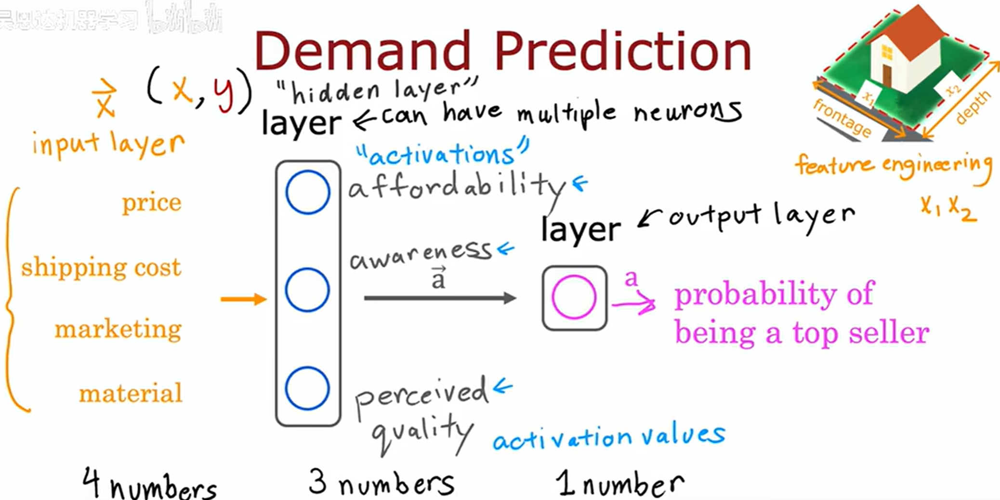

$\vec{a}$ 是隐藏层输出的激活向量，a 是神经网络的最终激活或最终预测。神经网络非常好的特性是，当从训练集中训练它，不需要决定当前层的需要专注的特征（例如上图中的 `price` `shipping cost` `marketing` `material`），神经网络会自己找出在隐藏层中想要使用的特征。

**自动特征工程**

- 深度学习通过反向传播和梯度下降**自动优化每一层的权重**，无需人工设计特征。例如：
	- CNN的卷积核自动学习图像的空间模式。
	- Transformer的注意力机制动态捕捉文本的上下文依赖。

> 传统机器学习（单层或浅层模型）的局限性
>
> * **特征依赖性强**：传统模型（如SVM、逻辑回归、决策树等）严重依赖人工特征工程。模型的性能很大程度上取决于特征提取的质量。
>
> - **线性或简单非线性**：即使使用核方法（如SVM）或集成学习（如随机森林），其非线性能力通常较浅，难以捕捉数据中的**层次化结构**（例如图像中的边缘→纹理→物体部件→整体物体）。
> - **高维数据表现差**：对于图像、语音、文本等高维数据，传统模型容易过拟合或计算效率低下。

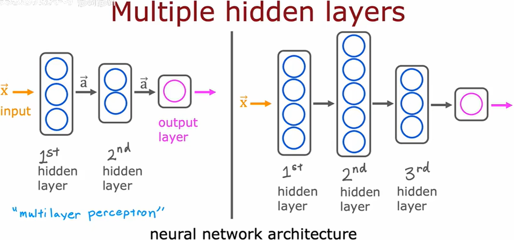

在构建神经网络时，需要做出的关键决策之一是确定隐藏层的数量以及神经元的数量。

在一些文献中，这种具有多个层的神经网络被称为**多层感知机（multi-layer perceptron [缩写 MLP]）**。

## 例子：图像识别

### 人脸识别（Face recognition）

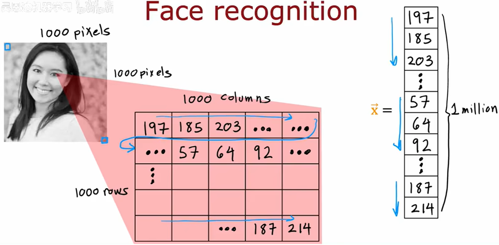

这张照片是 `1000x1000` 的像素 (pixels)，在计算机中实际表示为一个 `1000x1000` 的网格，在这个例子中像素的亮度值范围是 $[0, 255]$， $\vec{x}$ 是将网格展开后记录成的向量。

> 任务：训练一个神经网络，输入为包含一百万个像素亮度值的特征向量，输出为图片中人物的身份。

如果在一个大量人脸图像上训练过的神经网络，观察隐藏层中的不同神经元的计算过程，如下图所示。

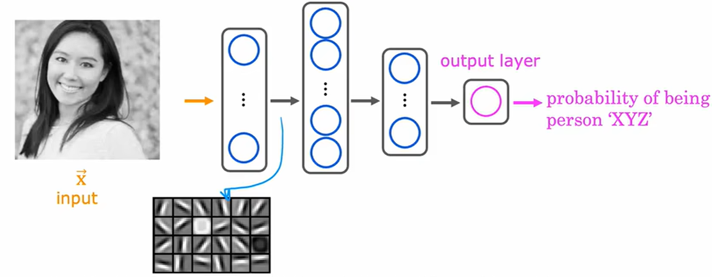

在网络的**第一隐藏层**（最底层），神经元通常学习检测基础的局部视觉特征：

- 某些神经元会对特定方向的边缘（如垂直、水平或对角线条）产生响应
- 其他神经元可能检测简单的纹理模式或颜色变化
- 这些特征具有平移不变性，能在图像的任何位置被识别

在神经网络的最早层，你可能发现神经元在图像中寻找非常短的线条或者边缘。

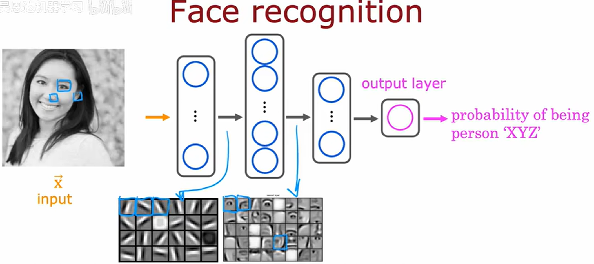

在**第二隐藏层**，这些神经元可能学会将许多小短线组合在一起，以便寻找面部的部分。

神经元会组合低级特征来构建更复杂的结构：

- 部分神经元学会检测面部组成部分（如眼角、鼻翼轮廓或眉毛片段）
- 这些检测器对特定面部区域的几何排列敏感
- 例如某个神经元可能在图像中出现眼睛轮廓时达到最大激活

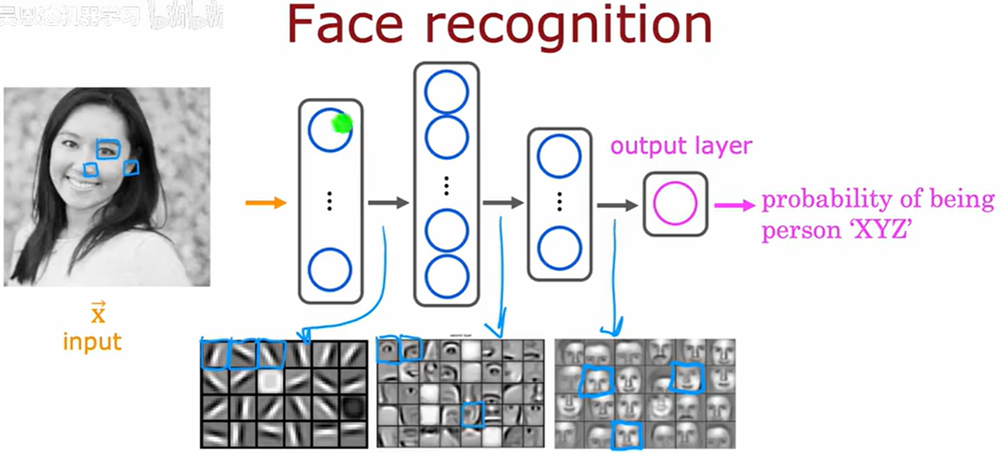

在**第三隐藏层**，神经网络正在聚合面部的不同部分，然后尝试检测是否存在更大更粗略的面部形状。

神经元进一步整合中级特征：

- 开始表征面部的整体空间结构（如眼鼻相对位置）
- 能够响应更高级的语义特征（如完整眼部区域或嘴部形状）
- 最终层神经元可能对应特定人脸身份或表情的抽象表征

> 这种层级特征学习机制（从边缘→局部部件→整体结构）正是卷积神经网络（CNN）能有效处理视觉任务的核心原因。随着网络深度增加，特征的语义层级逐步提升，空间敏感性逐渐降低。

在深度神经网络中，随着层级的加深，神经元感受野（receptive field）会逐层扩大，从而能够检测越来越复杂的特征：

- **第一隐藏层**的神经元具有较小的**感受野**，通常只能检测图像中局部区域的低层特征（如边缘、纹理或颜色变化）。
- **第二隐藏层**的神经元的感受野更大，能够整合前一层的局部特征，从而检测更复杂的结构（如眼睛轮廓、鼻子局部等）。
- **更高层的神经元**的感受野进一步扩大，能够覆盖图像的更大部分，甚至全局上下文信息，从而识别高级语义特征（如完整的人脸、物体或场景）。

从上述例子可知：

深层网络的激活值表征更高层次的特征

神经网络激活值在不同层级中逐步编码更高层次的特征

### 汽车分类（Car classification）

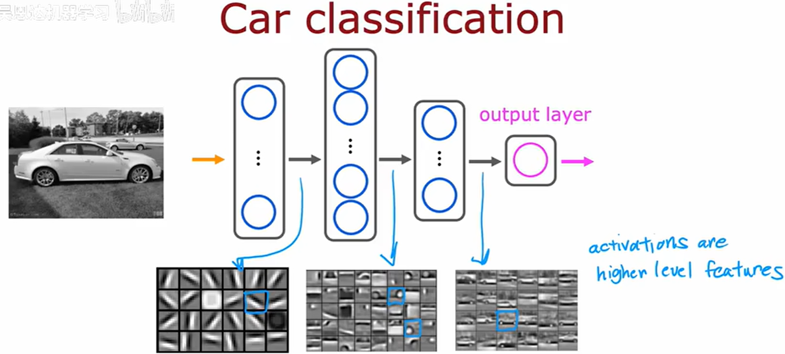

同理，第一隐藏层学习边缘，第二隐藏层学习检测汽车部分，第三隐藏层学习更完整的汽车形状。

所以只需提供不同的数据，神经网络就会自动学习检测非常不同的特征。

**稳定性与记忆功能的正确理解**：

✓ 神经网络确实**没有传统意义上的长期记忆**（不像人类大脑）
✓ 其"记忆"完全存储在模型参数（权重）中
✓ 但稳定性取决于：

- 训练数据的充分性和代表性
- 正则化技术的使用（如dropout, weight decay）
- 模型容量与任务复杂度的匹配程度

**关键区别**：

- **灾难性遗忘**(Catastrophic Forgetting)：
	当用新数据重新训练时，网络会覆盖之前学到的模式（除非采用持续学习技术）
- **参数稳定性**：
	良好训练的模型对同类数据的小变化应保持稳定（通过权重正则化实现）

## 神经网络中的层

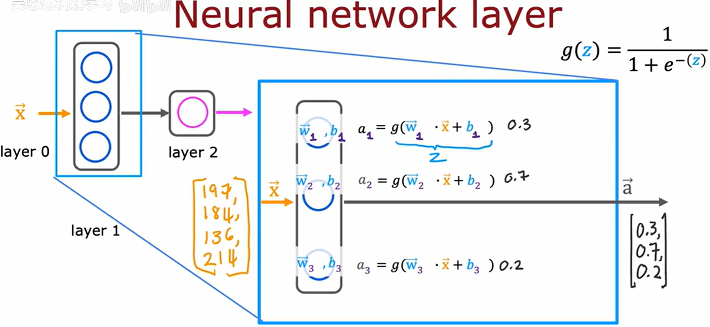

> 输入层有的时候会被称为 `layer 0`

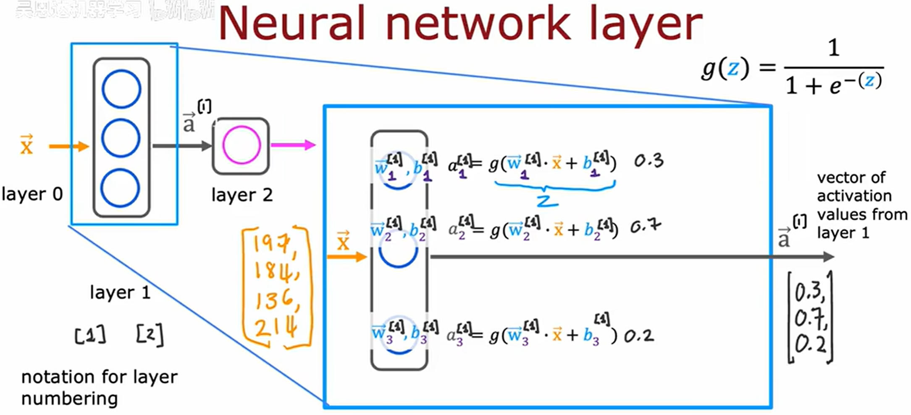

> 采用上标 $[i]$ 来表示第 $i$ 层
>
> 下标 $j$ 表示该层的第 $j$ 个隐藏神经元
>
> $\vec{a}^{[1]}$ 表示 layer 1 的激活值

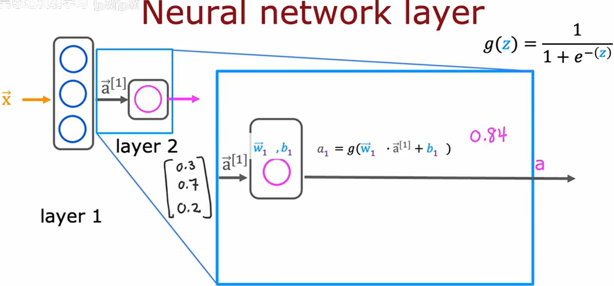

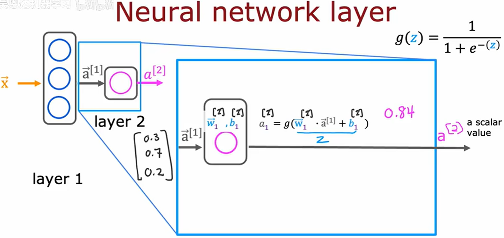

上层激活作为下层输入

> a scalar value 一个标量值

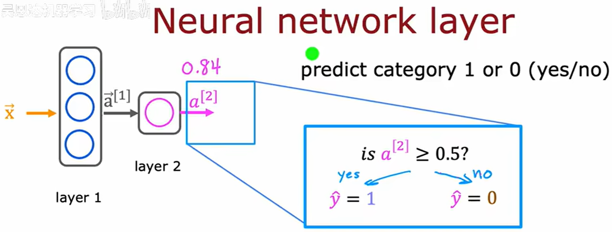

最后一步，根据阈值 (threshold) 处理预测结果。

