# 机器学习简介

> 机器学习：计算机在没有明确编程的情况下学习

## 机器学习的大致分类

1. 监督学习（supervised learning）
2. 无监督学习（unsupervised learning）
3. 强化学习（Reinforcement learning）

## 监督学习 (Supervised learning)

> 特点：learn from data labeled with "right answers"

**输入x→输出y**

分为两类：`回归（regression）` 和 `分类（classification / predict categories）` 

### Regression

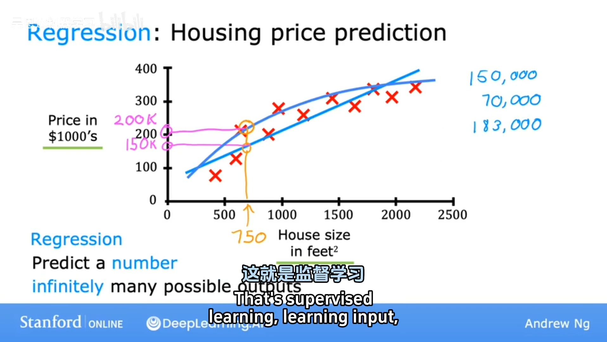

**预测无限多个可能的数字中的任意一个**

### Classification / Predict categories

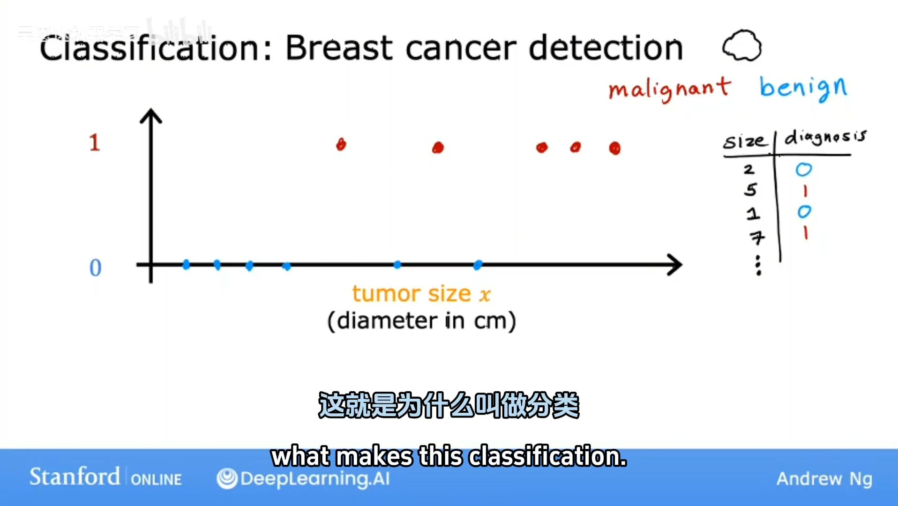

**预测输出的结果有限【a small number of possible outputs】**

## 无监督学习 (Unsupervised learning)

> 特点：not any label

分为 `clustering algorithm（聚类算法）` `anomaly detection（异常检测）` `dimensionality reduction（降维）` 

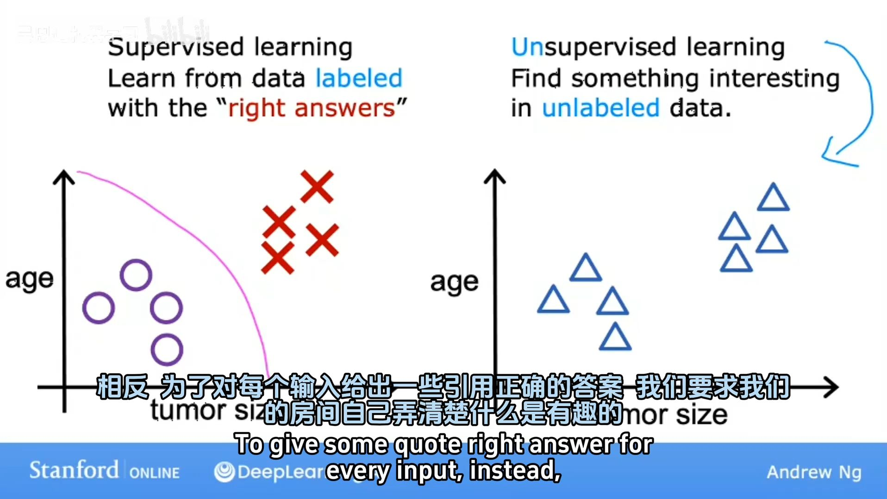

### Clustering algorithm

**定义**：
聚类是一种无监督学习技术，旨在将数据分成若干组（簇），使得同一组内的数据点彼此相似，而不同组之间的数据点差异较大。相似性通常通过距离度量（如欧氏距离、余弦相似度）来定义。

**典型算法**：

- **K-Means**：基于中心点的迭代聚类，需预先指定簇数（K）。
- **层次聚类**：通过树状图（Dendrogram）构建簇的层次结构，可分聚合（自底向上）或分裂（自顶向下）两种。
- **DBSCAN**：基于密度的聚类，可识别任意形状的簇并自动剔除噪声点。
- **谱聚类**：基于图论，利用数据相似性矩阵的特征向量进行划分。

**应用场景**：

- **相似内容推送**：将用户浏览/购买历史聚类，推荐同一簇中的其他内容（如新闻、商品）。
- **客户画像**：根据消费行为、 demographics 等将客户分群，制定精准营销策略。
- **图像分割**：将像素点按颜色或纹理聚类，划分图像区域。

### Anomaly Detection

**定义**：
识别数据中明显偏离正常模式的罕见事件或异常点。核心假设是异常数据在特征空间中与正常数据存在显著差异。

**常用方法**：

- **统计方法**：假设数据服从某种分布（如高斯分布），超出阈值（如3σ）视为异常。
- **隔离森林（Isolation Forest）**：通过随机划分快速隔离异常点（所需划分次数较少）。
- **一类SVM（One-Class SVM）**：仅用正常数据训练，将边界外的点判为异常。
- **自编码器（Autoencoder）**：通过重构误差检测异常（异常数据重构误差大）。

**应用场景**：

- **金融欺诈检测**：识别异常交易（如短时间内大额转账）。
- **工业设备监控**：传感器数据异常预示故障。
- **网络安全**：检测入侵行为（如异常登录IP）。

### Dimensionality Reduction

**定义**：
将高维数据映射到低维空间，保留主要信息的同时减少计算复杂度、避免“维度灾难”。可分为线性和非线性方法。

**典型技术**：

- **PCA（主成分分析）**：线性方法，通过特征值分解找到方差最大的正交方向（主成分）。
- **t-SNE**：非线性降维，侧重保留局部相似性，常用于可视化（如将高维数据降至2D/3D）。
- **UMAP**：类似t-SNE但计算效率更高，保留全局和局部结构。
- **自动编码器（Autoencoder）**：神经网络通过编码-解码学习紧凑表示。

**应用场景**：

- **数据可视化**：将高维特征（如文本TF-IDF、基因数据）降至2D/3D绘图。
- **特征工程**：减少噪声特征，提升模型训练效率（如人脸识别中的PCA降维）。
- **去冗余**：消除高度相关的特征（如传感器网络中相似读数）。

### 对比总结

| **技术** | **核心目标** | **关键特点**                   | **典型场景**           |
| :------- | :----------- | :----------------------------- | :--------------------- |
| 聚类算法 | 数据分组     | 无监督、依赖相似性度量         | 客户分群、推荐系统     |
| 异常检测 | 识别离群点   | 处理不平衡数据、需定义正常模式 | 欺诈检测、设备故障预警 |
| 降维     | 压缩数据维度 | 保留主要信息、降低计算成本     | 可视化、特征预处理     |

这些技术常结合使用，例如先用PCA降维再聚类，或在降维后的空间中检测异常。

## 强化学习 (Reinforcement learning)

### 强化学习（Reinforcement Learning, RL）概述

强化学习是一种机器学习范式，其核心思想是**智能体（Agent）通过与环境的交互学习最优策略（Policy）**，以最大化累积奖励（Reward）。RL 不同于监督学习（有标签数据）和无监督学习（无明确目标），它通过试错（Trial-and-Error）和延迟奖励（Delayed Reward）进行学习。

### 1. 强化学习的核心要素

| **要素**                       | **说明**                                                     |
| :----------------------------- | :----------------------------------------------------------- |
| **智能体（Agent）**            | 学习的主体，负责做出决策（如游戏AI、自动驾驶系统）。         |
| **环境（Environment）**        | 智能体交互的外部系统（如游戏世界、股票市场）。               |
| **状态（State）**              | 环境在某一时刻的描述（如游戏画面、机器人传感器数据）。       |
| **动作（Action）**             | 智能体在某个状态下可执行的操作（如移动、买入股票）。         |
| **奖励（Reward）**             | 环境对智能体动作的即时反馈（如得分增加、任务完成）。         |
| **策略（Policy）**             | 智能体的决策规则，即从状态到动作的映射（如“如果状态A，则执行动作B”）。 |
| **价值函数（Value Function）** | 评估长期累积奖励的期望（如当前状态未来能获得多少总奖励）。   |

### 2. 强化学习的典型算法

强化学习算法可分为：

#### (1) 基于价值（Value-Based）的方法

- **目标**：学习最优价值函数（如Q值），间接推导策略。
- **代表算法**：
	- **Q-Learning**：通过更新Q表（状态-动作价值表）学习最优策略。
	- **Deep Q-Network (DQN)**：用神经网络近似Q值，解决高维状态问题（如Atari游戏）。
	- **Double DQN**：改进DQN，减少Q值高估问题。
	- **SARSA**：与Q-Learning类似，但采用“在策略（On-Policy）”更新。

#### (2) 基于策略（Policy-Based）的方法

- **目标**：直接优化策略函数（如神经网络），适用于连续动作空间。
- **代表算法**：
	- **REINFORCE**：蒙特卡洛策略梯度法，通过采样轨迹更新策略。
	- **Actor-Critic**：结合价值函数（Critic）和策略（Actor），提高稳定性。
	- **Proximal Policy Optimization (PPO)**：改进策略梯度，约束更新幅度，防止策略突变。
	- **Soft Actor-Critic (SAC)**：引入熵正则化，鼓励探索，适用于复杂任务。

#### (3) 基于模型（Model-Based）的方法

- **目标**：学习环境模型（如状态转移概率），再基于模型规划（Planning）。
- **代表算法**：
	- **Dyna-Q**：结合模型学习和Q-Learning。
	- **Monte Carlo Tree Search (MCTS)**：用于AlphaGo等博弈AI。
	- **World Models**：用生成模型（如VAE+RNN）模拟环境动态。

### 3. 强化学习的应用场景

| **领域**       | **应用示例**                                              |
| :------------- | :-------------------------------------------------------- |
| **游戏AI**     | AlphaGo（围棋）、OpenAI Five（DOTA2）、Atari游戏AI        |
| **机器人控制** | 机械臂抓取、四足机器人行走（如波士顿动力）                |
| **自动驾驶**   | 路径规划、避障决策（如Tesla Autopilot）                   |
| **金融交易**   | 量化交易策略优化（如股票、加密货币自动交易）              |
| **推荐系统**   | 动态调整推荐策略以最大化用户长期满意度（如YouTube、淘宝） |
| **医疗**       | 个性化治疗策略（如调整药物剂量）                          |

### 4. 强化学习 vs 其他机器学习方法

| **对比维度** | **强化学习（RL）**         | **监督学习（SL）** | **无监督学习（UL）**   |
| :----------- | :------------------------- | :----------------- | :--------------------- |
| **数据需求** | 无需标注数据，依赖环境交互 | 需要大量标注数据   | 无需标注数据           |
| **目标**     | 最大化累积奖励             | 最小化预测误差     | 发现数据模式（如聚类） |
| **反馈类型** | 延迟奖励（稀疏、非线性）   | 即时误差信号       | 无明确反馈             |
| **典型问题** | 决策优化（如游戏、控制）   | 分类、回归         | 降维、生成             |

## 机器学习常用术语 (Terminology)

Notation：

* **`x`**: `input` / `input feature` / `feature`（输入特征【相当于变量】）

- **`y`**: `target`（目标变量）或 `label`（分类任务中的标签）
- **`f`**: `function / model`

 $$x -> f -> \hat{y}$$

> $x$ : input / input feature
>
> $f$ : function / model
>
> $\hat{y}$ : "y-hat" / prediction / estimated y

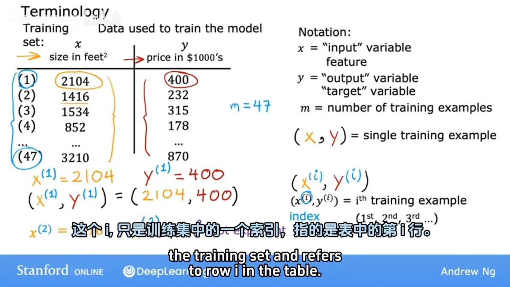

$(x, y)$ -> single training example

$(x^{(i)}, y^{(i)})$ -> $i^{th}$training example

# 监督学习 (Supervised learning)

> 特点：learn from data labeled with "right answers"

## 线性回归 (Linear Regression)

### 单变量线性回归 (Univariate linear regression)

univariate -> 单变量

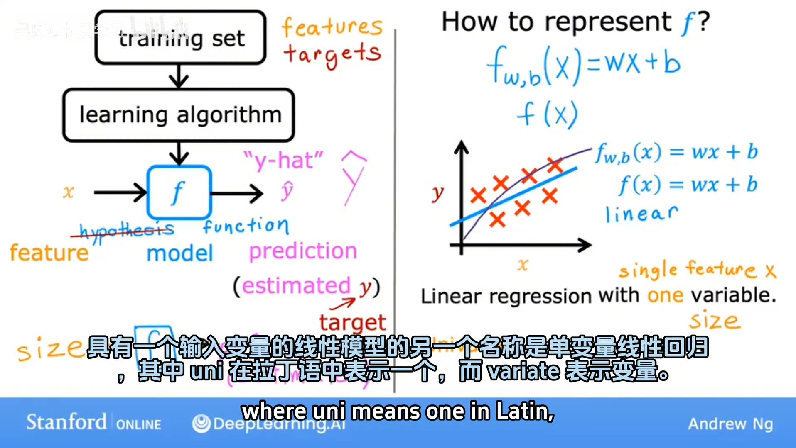

### 代价函数 (Cost function)

**代价函数（cost function）：**用来衡量假设函数f(x)准确性的工具

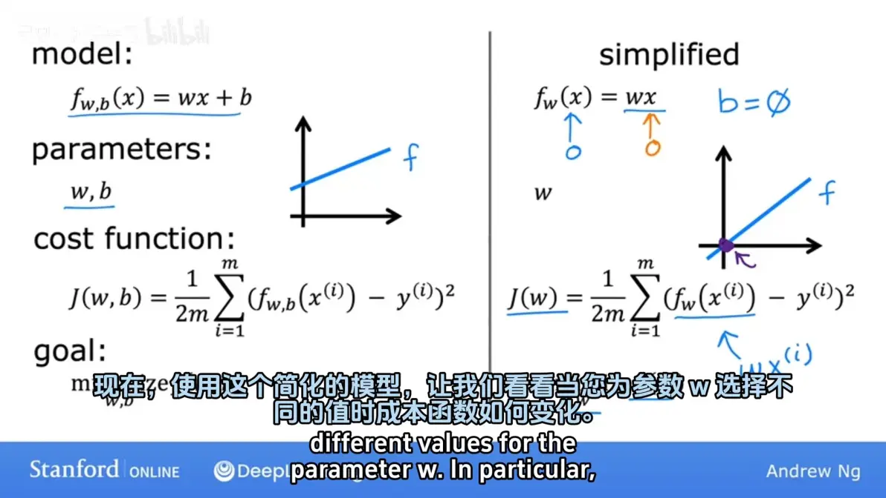

**线性回归的目标是找到参数w和b，使代价函数J的值最小 **

$$
\begin{cases}
\hat y ^ {(i)} = f_{w, b}(x^{(i)}) \\
f_{w, b}(x^{(i)}) = wx^{(i)} + b
\end{cases}
$$

slop: 斜率

**误差 (error): **
$$
y - \hat y
$$
**平方误差 (squared error): **
$$
(\hat y ^ {(i)} - y ^ {(i)}) ^ 2
$$

其中 $\hat y − y$ 就是**误差项（error term）**，通常记作  *ϵ*  或  *e*。

【Squared error cost function】
$$
\sum_{i=1}^m (\hat y^{(i)} - y^{(i)}) ^ 2
$$
**m => the number of training examples**

**Cost function（代价函数）：**
$$
\frac{1}{2m} \sum_{i=1}^m (\hat y^{(i)} - y^{(i)}) ^ 2
$$
**divide by 2 -> 是方便后续计算整洁>**

用 $J$ 来表示代价函数：
$$
J(w, b) = \frac{1}{2m} \sum_{i=1}^m (\hat y^{(i)} - y^{(i)}) ^ 2
$$

回归的目标：**通过最小化代价函数 -> 找到最好的参数**

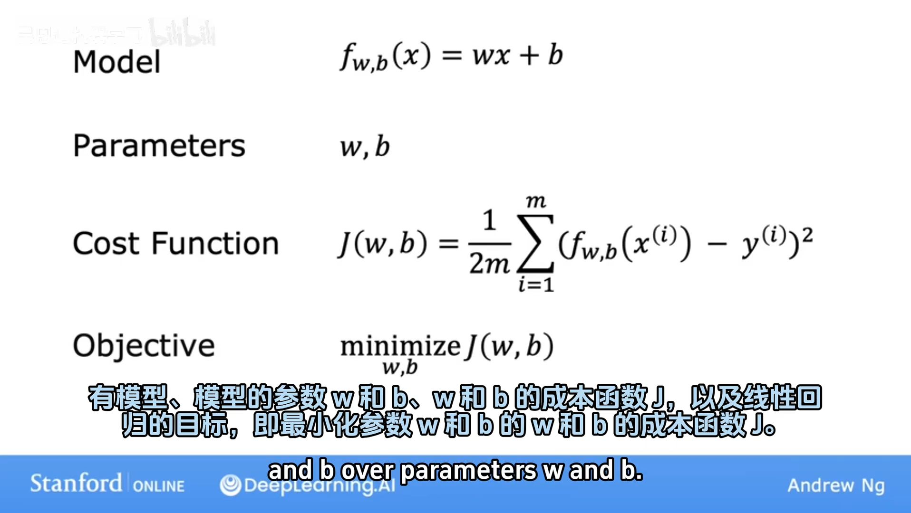

**$f_{w}(x)=wx$ 的代价函数**

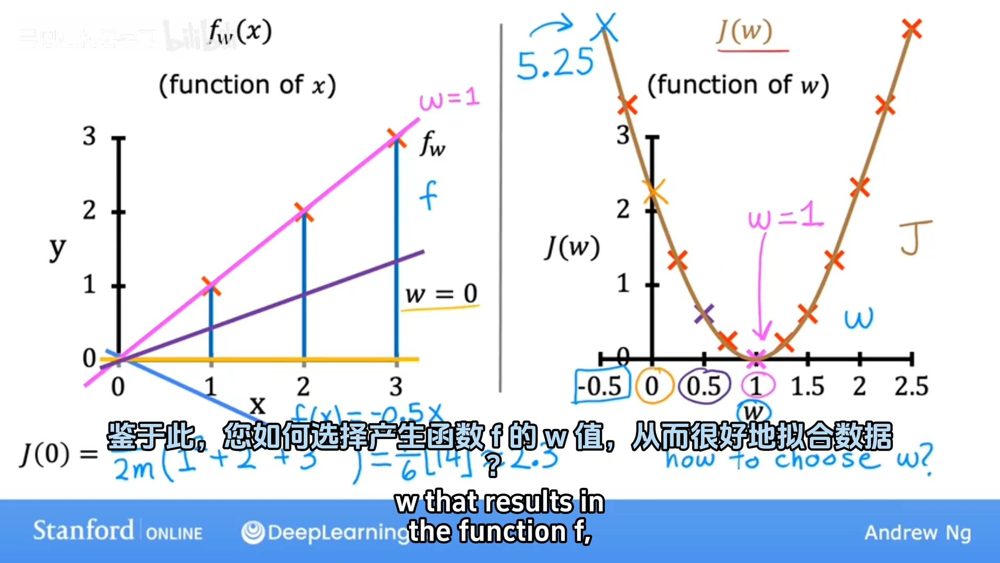

**$f_{w, b}(x)=wx+b$ 的代价函数**

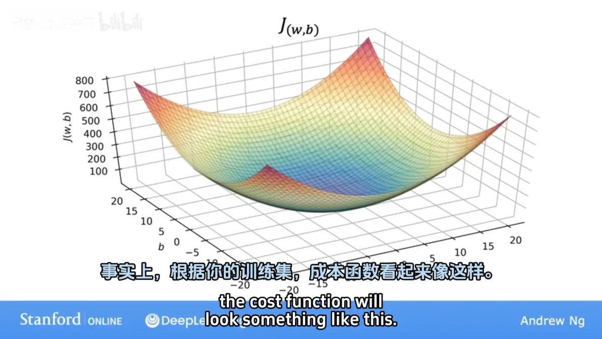

等高线绘制：椭圆的中心点即为代价函数 $J(w,b)$ 的最小值

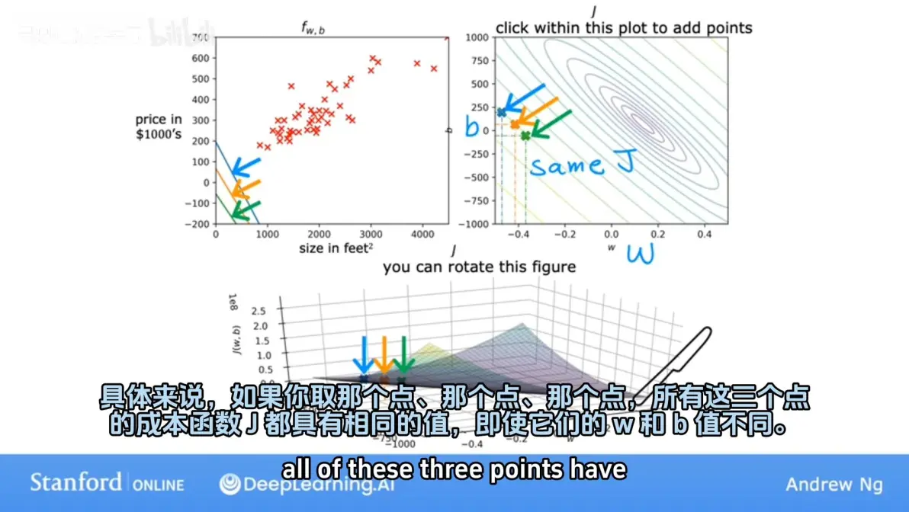

### 梯度下降 (gradient descent) 及公式由来

**梯度下降：**寻找代价函数的最小值（只能找到局部最低点）

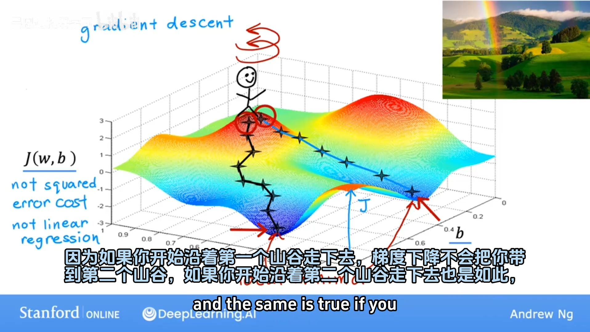

梯度下降公式：

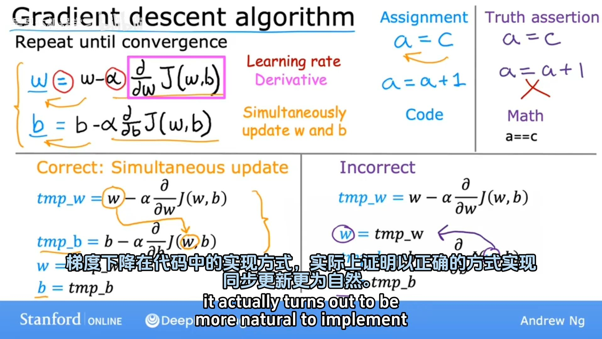

> 数学基础

导数 偏导数 梯度

导函数 偏导函数 方向导数

**偏导** => 相当于求沿着x轴 y轴的导数

例如，求沿 x 轴的偏导，这样平行 x 轴正方向形成一个切面，这时 y 就会成为一个常数，因为切面仅占 y 轴中的一个点。

偏导仅能求平行 x 轴、y 轴的方向的变化趋势

通过叠加 x轴、y轴的方向向量，得到各个方向的变化趋势 => **方向导数** 

（x、z 轴）

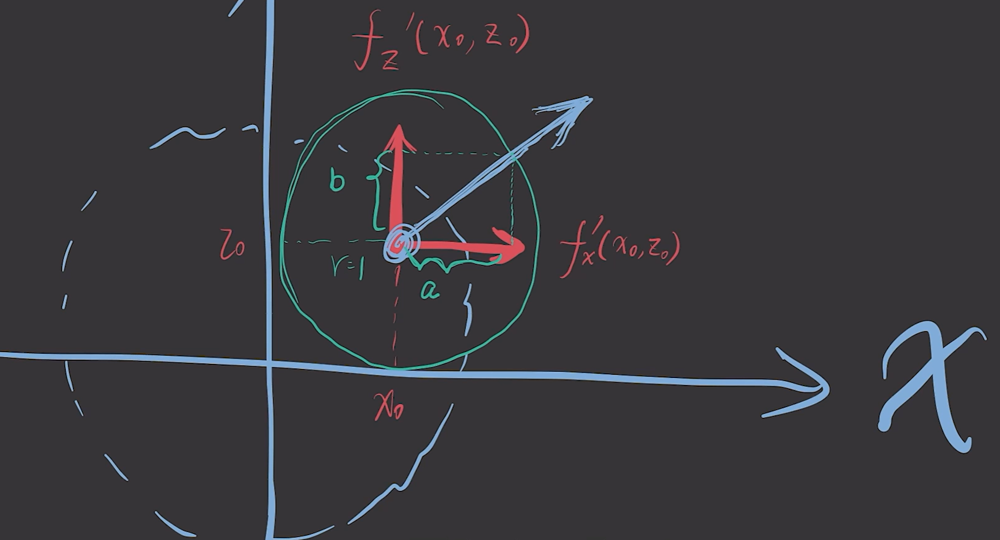

**梯度 => 沿着哪个方向走的最快**

**如果要向其他方向，就需要对两种的数值进行修改，从而才能调整方向，而这种修改都是减小的方式进行的。**【类似物理中的两方向不同的力进行叠加】

不损失两边的数值，两边的数值都利用好，对应的方向就是 $(f_z'(x_0, y_0), f_x'(x_0, y_0))$。

因此就得到了梯度下降的公式【**因为两轴方向的数值吃满 因此直接减去偏导**】：
$$
\begin{cases}
w = w - α\frac{∂}{∂w}J(w,b) \\
b = b - α\frac{∂}{∂b}J(w,b)
\end{cases}
$$
**由梯度公式推导而来，可知两个变量必须同时变化。**

α：学习率，即往下走的步子大小

（α不能过大也不能过小，要合理选择）

求偏导易得以下结果：

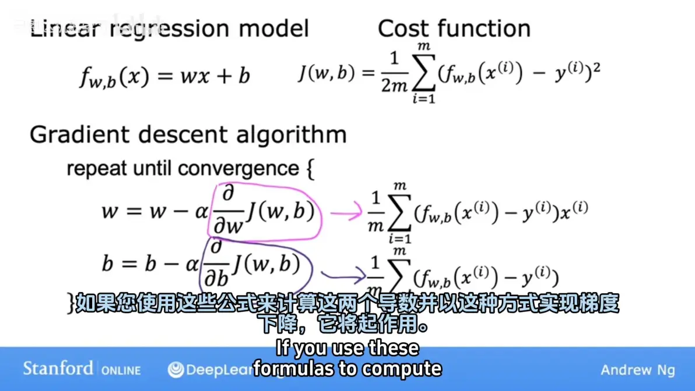

$$
J(w,b) = \frac{1}{2m} \sum\limits_{i = 0}^{m-1} (f_{w,b}(x^{(i)}) - y^{(i)})^2
$$

$$
\begin{align}
\frac{\partial J(w,b)}{\partial w}  &= \frac{1}{m} \sum\limits_{i = 0}^{m-1} (f_{w,b}(x^{(i)}) - y^{(i)})x^{(i)} \\
  \frac{\partial J(w,b)}{\partial b}  &= \frac{1}{m} \sum\limits_{i = 0}^{m-1} (f_{w,b}(x^{(i)}) - y^{(i)}) \\
\end{align}
$$

### 梯度下降的变体

- **批量梯度下降(BGD)**：每次迭代计算梯度时使用全部训练样本（严格对应代价函数的定义）
- **随机梯度下降(SGD)**：每次随机使用1个样本计算梯度近似
- **小批量梯度下降(MBGD)**：每次使用一个小样本子集（如32/64个样本）

**计算效率的权衡**：

- BGD：梯度方向准确但计算慢
- SGD：计算快但噪声大
- MBGD：平衡两者

> 在机器学习和优化算法的上下文中，**噪声（Noise）指的是梯度估计或优化过程中的随机波动或不准确性**。它通常是由于使用数据的子集（而非全体数据）来计算梯度而引入的。

**噪声的来源**

- **随机梯度下降（SGD）**：每次迭代仅用**1个随机样本**计算梯度，该样本的梯度可能与全体数据的真实梯度方向差异很大，这种偏差就是噪声。
- **小批量梯度下降（MBGD）**：用一个小批量（如32个样本）计算梯度，虽然比SGD更稳定，但仍会引入噪声（因为不是全体数据）。
- **批量梯度下降（BGD）**：理论上无噪声（用全体数据计算梯度），但计算成本高。

**批量梯度下降：每一步下降都使用训练集中的所有样本数据进行计算** （就是上述推导采用的）

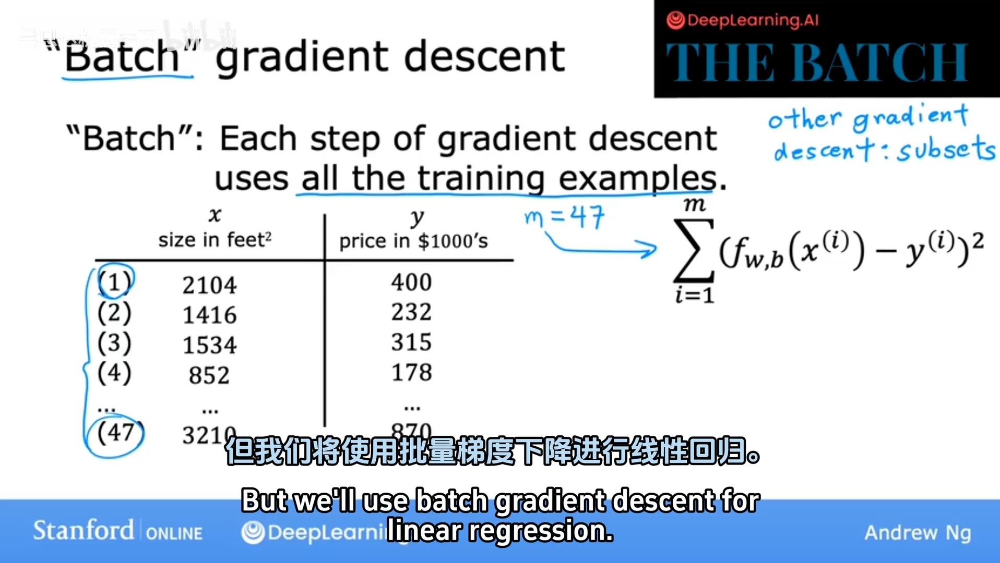

### Quiz

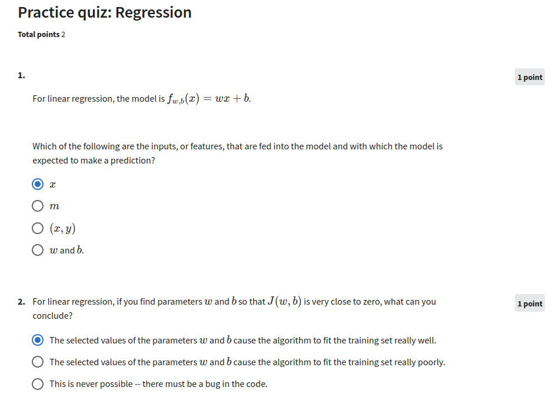

### 多类特征 (Multiple features)

**多类特征：**x 为多个特征组成的向量

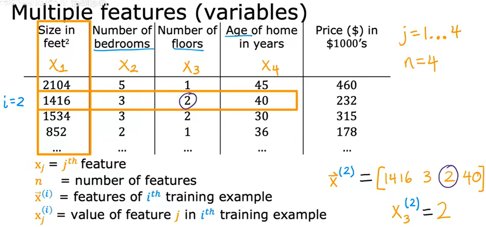

> $\vec{x}^{(i)}$ 上的向量符号是可选的，不是必须采用的。

### 多元线性回归 (Multiple linear regression)

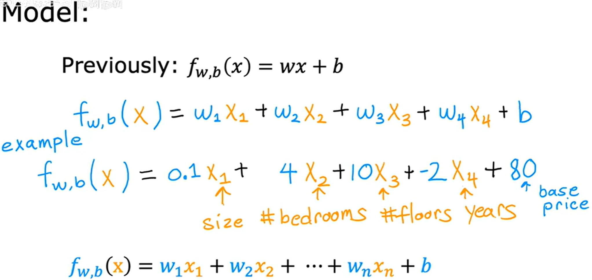

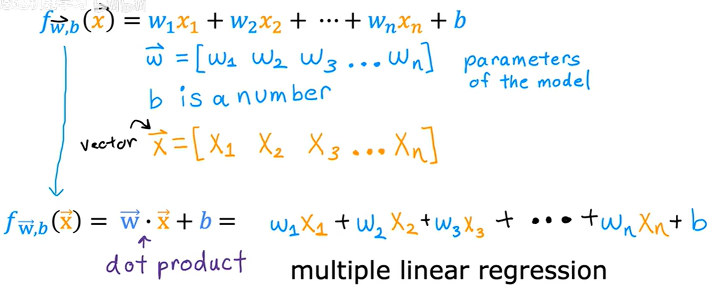

### 向量化 (Vectorization)

**通过向量化，可以较为简洁表达公式，同时编程中也可以提高执行性能。**

编写向量化代码，充分利用线性代数及GPU硬件。

> 原理：多线并行计算，比for循坏快很多

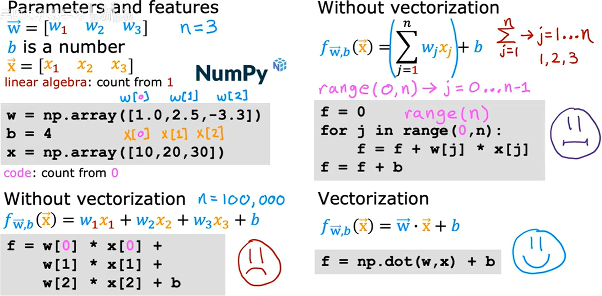

**`*` 和 `dot` 对比**

| 运算类型            | 是否默认并行 | 说明                                        |
| :------------------ | :----------- | :------------------------------------------ |
| `np.dot(A, B)`      | ✅ 是         | 调用 BLAS 库（如 OpenBLAS/MKL），支持多线程 |
| `A * B`（逐元素乘） | ❌ 否         | 通常单线程，但可能用 SIMD 向量化加速        |

**原因**

- `*` 是 **逐元素运算**，计算模式简单，并行开销可能超过收益。
- `np.dot` 是 **矩阵乘法**，计算密集，BLAS 库会主动优化并行。

**`np.dot` 为什么比 Python 循环快？**

| 对比项       | `np.dot`（C + BLAS）          | Python 循环          |
| :----------- | :---------------------------- | :------------------- |
| **执行方式** | 编译后的机器码                | 解释执行（逐行翻译） |
| **内存访问** | 连续内存优化（SIMD）          | 无优化，缓存效率低   |
| **并行计算** | 多线程 + SIMD 指令            | 单线程               |
| **底层优化** | 调用 BLAS（如 MKL、OpenBLAS） | 无优化               |

> 正常发行版的NumPy貌似不能使用GPU，PyTorch可以，或CuPy

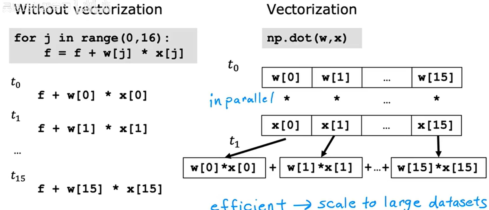

> 然而NumPy在小规模的时候用的不是多线程，大规模才会使用

向量化通过并行运算极大提升了效率，类似于一种空间换时间的 trade off，同时也表明了向量化的高效主要体现于大数据集的机器学习。

向量化表示多元线性回归的梯度下降：

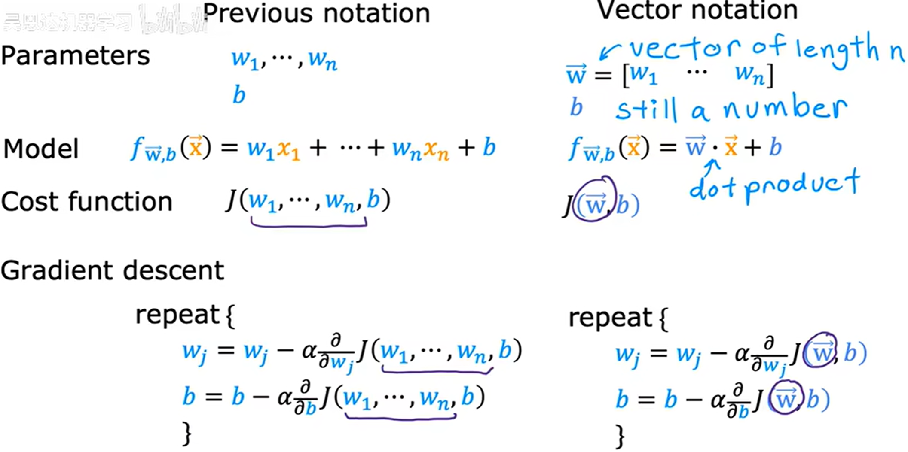

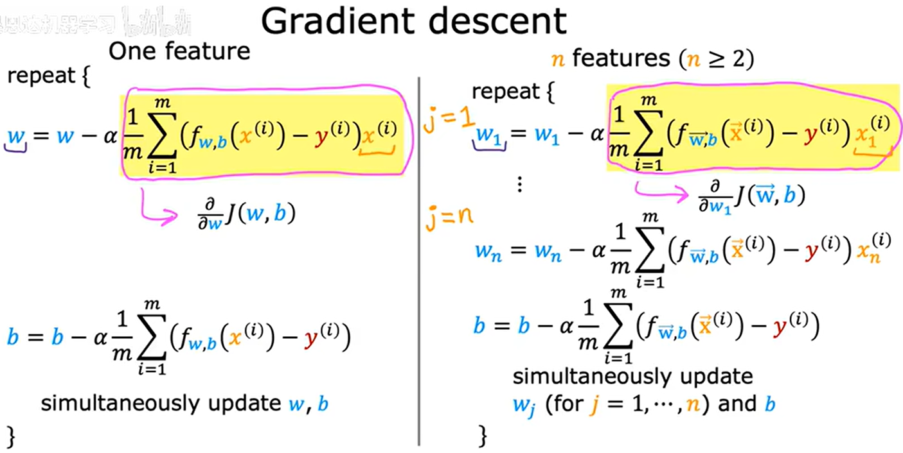

### 正规方程 (Normal equation)

* Only for linear regression
* Solve for w, b without iterations

Disadvantages:

* Doesn't generalize to other learning algorithms. (如逻辑回归算法、神经网络其他算法等)
* Slow when number of features is large (> 10,000)

**实际工业场景中，机器学习从业者几乎不会手动实现正规方程（Normal Equation）**，而是直接调用优化过的库函数（如 `scikit-learn`、`statsmodels` 或数值计算库）。

### 正规方程 vs 梯度下降

#### 1. 正规方程（解析解）

- **定义**：
	直接通过数学公式求解线性回归的最优参数 $(w,b)$：
	$$
	\mathbf{w} = (\mathbf{X}^T \mathbf{X})^{-1} \mathbf{X}^T \mathbf{y}
	$$
	
- **适用场景**：

	- **小规模数据**（特征数 $n < 10^4$）。
	- **机器学习库中的实现**（如 `scikit-learn` 的 `LinearRegression`）。

- **优点**：

	- 无需迭代，直接得出解析解。
	- 无需调整超参数（如学习率）。

- **缺点**：

	- 计算复杂度高 $O(n^3)$，不适用于高维数据。
	- 若 $\mathbf{X}^T \mathbf{X}$ 不可逆（如特征共线性），需使用伪逆或正则化。

#### 2. 梯度下降（迭代优化）

- **定义**：
	通过迭代调整参数 $(w,b)$，逐步最小化损失函数（如均方误差）。
- **适用场景**：
	- **大规模数据**（特征数或样本量极大）。
	- **深度学习和其他复杂模型**（如神经网络）。
- **优点**：
	- 计算效率高（支持分批计算，如随机梯度下降）。
	- 可扩展至非线性模型。
- **缺点**：
	- 需选择学习率等超参数。
	- 可能收敛到局部最优（凸问题如线性回归无此问题）。

#### 实际应用建议

1. **优先调库**：
	- 使用 `scikit-learn` 的 `LinearRegression`（内部基于正规方程或SVD）。
	- 大规模数据用 `SGDRegressor`（梯度下降实现）。
2. **手动实现的场景**：
	- 教学/面试时理解原理。
	- 定制化需求（如添加特殊约束）。
3. **数值稳定性**：
	- 若手动实现，用 `np.linalg.pinv` 替代逆矩阵计算。

### 特征缩放

#### 问题的发现

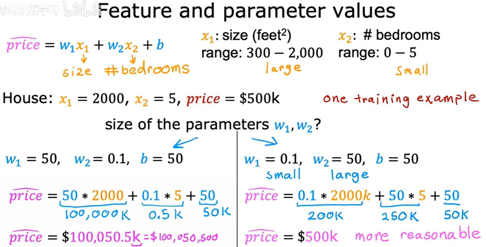

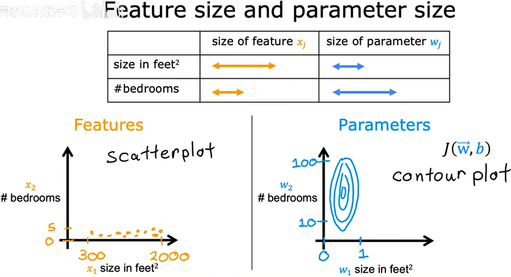

> contour plot 等高线图

$x_1$、$x_2$ 取值大小相差较大，导致等高线图中 $w_1$、$w_2$ 取值在两轴上，一侧数值较大，一侧数值较少。

如上图中 $w_2$ 需要变动很大才能保持“等高”，而 $w_1$ 仅需要一点变动数值就可以了。

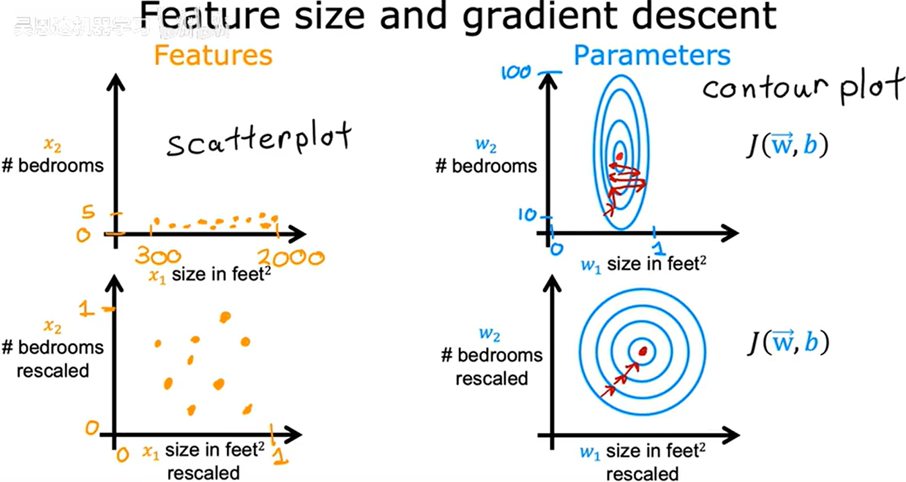

同一个学习率对于不同的特征不一定都适合，比如 $w_1$ 的取值很小，学习率一定时梯度变换的幅度就会很大，就会来回跳，而 $w_2$ 变换幅度较小，正常逼近。

当不用的特征值取值范围差异很大时，可能导致梯度下降非常缓慢。但是经过重新缩放不同的特征使它们都在相似的范围内取值，这样可以显著加快梯度下降的速度。

如图中通过重新缩放的 $x_1$、$x_2$，等高线会更接近于一个圆形。

#### 实现特征缩放

**进行特征缩放的根本原因是学习率对每个特征都是固定的。**

**除以最大值**

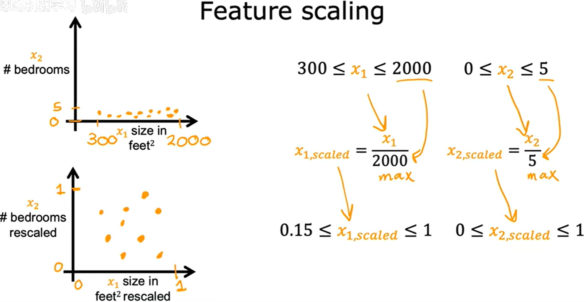

##### 均值归一化 (Mean normalization)

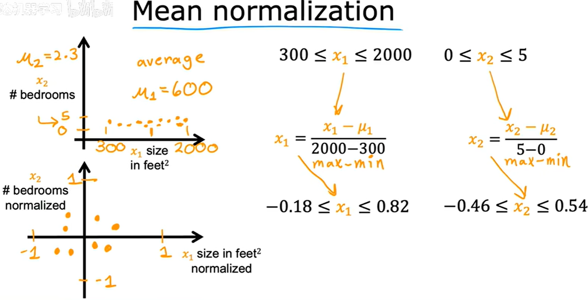

$$
x_i = \frac{x_i - μ_i}{max - min}
$$

> 将平均值去当作原点，$x_i$ 减去平均值 $μ_i$ 可以当作数值在原点附近的分布位置。在上图 $x_1$ 的范围 $2000-300$ 可以看作是 $x_1$ 的变化幅度，将原点附近的数值除以他的变化幅度来实现它的归一化。

##### 标准差标准化 / Z-score归一化 (Z-score normalization)

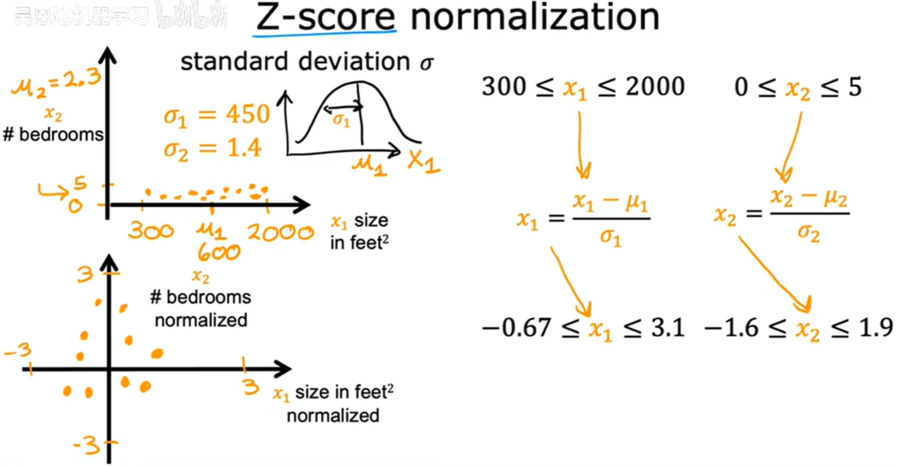

概率统计中，正态分布的标准化将参数为 $(μ, σ^2)$ 的正态分布化为参数为 $(0, 1)$ 的标准正态分布。

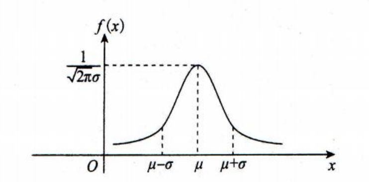

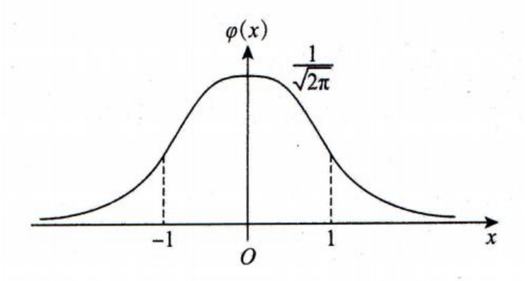

**经验定律 (a rule of thumb)**

不需要严格徘徊在 [-1, 1] 之间

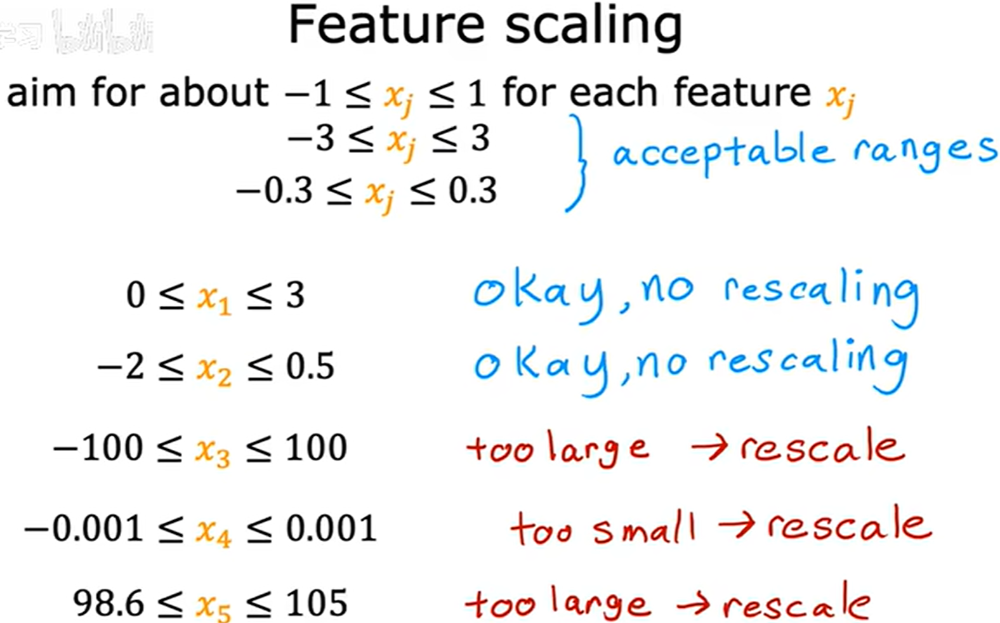

当然 ，数据归一化并不是万能的。在实际应用中，通过梯度下降法求解的模型通常是需要归一化的包括线性回归、逻辑回归、支持向量机、 神经网络等模型，但对于决策树模型则并不适用。

### 检查梯度下降是否收敛

> 单词解释
>
> converge	收敛

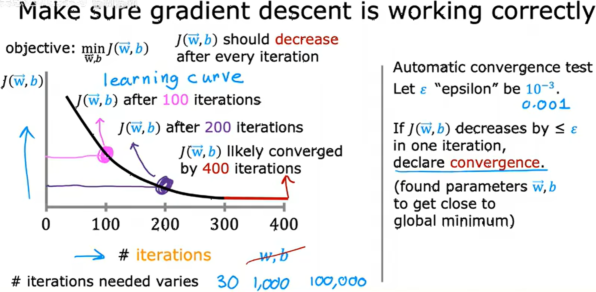

> 如果 $J$ 的值在一次迭代后增加，通常意味着学习率α选择不当即学习率过大，或者代码中有bug。

收敛的判断

* 通过学习曲线判断

* 通过自动收敛测试

自动收敛需要寻找合适的阈值 $ε$ ，这点相当困难。

### 选择学习率

> 选择合适学习率非常重要，学习率过小会导致梯度下降速度太慢，学习率过大会甚至导致不会收敛。

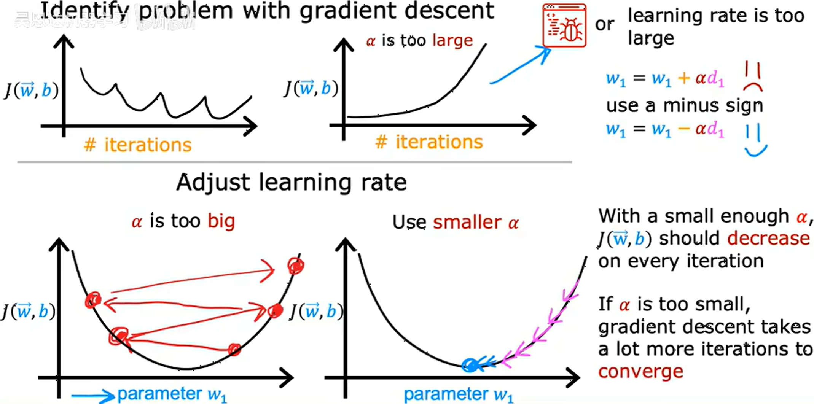

常将学习率设置很小，用来调试代码是否正确。

反复调试来选择到一个合适的学习率

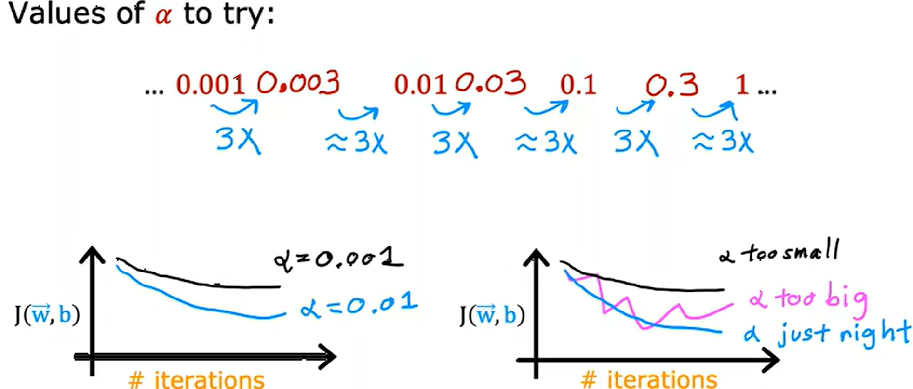

### 特征工程 (Feature engineering)

特征选择对学习算法的性能有巨大的影响

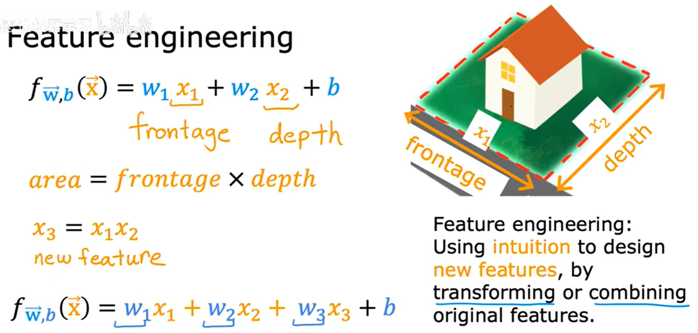

## 多项式回归 (Polynomial Regression)

通过将**多元线性回归**与**特征工程**结合，通过构造多项式特征来扩展线性模型的能力，从而形成**多项式回归（Polynomial Regression）**。这是一种经典且强大的方法，可以拟合非线性关系。

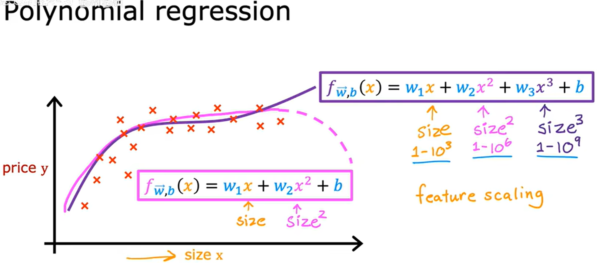

> 在出现平方、立方后，对特征进行缩放尤为的重要。

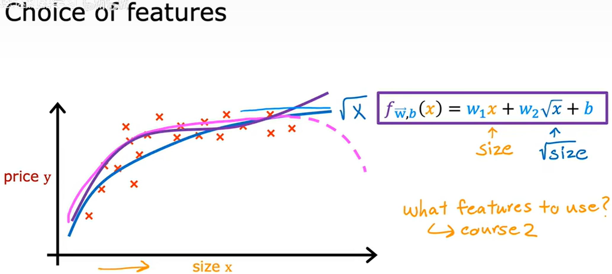

## 逻辑回归 (Logistic Regression)

### 问题的引出

假设使用线性回归来解决分类问题

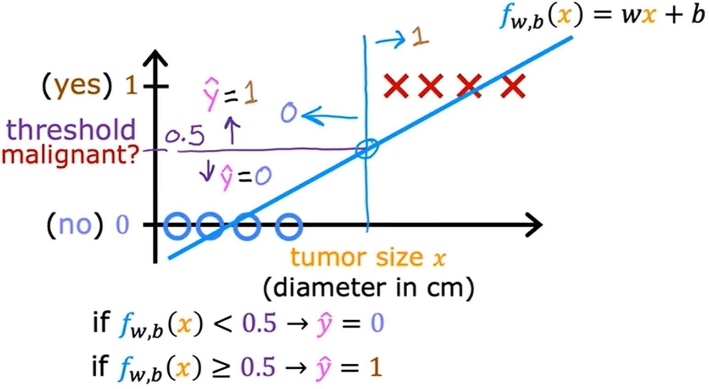

看起来还不错，但若是沿横轴正方向的远处加入训练样本，就会导致线性回归的拟合线偏移，如下图所示。

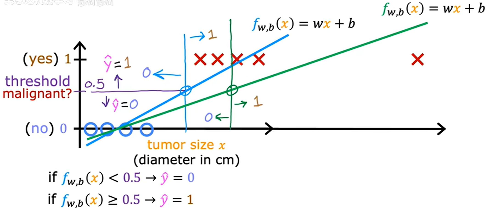

> 图中决策边界右移，这样就会导致先前的部分训练样本预测值从 yes 变为 no。

整个模型变的很糟糕。

**分类问题的目标是找到一个决策边界，能够正确区分不同类别的样本。理想情况下，决策边界应该由靠近边界的样本（支持向量）决定，而不是由远处的样本点决定。**

**在分类问题中，增加新的训练样本（尤其是远离决策边样的样本）不应显著改变原有的分类结论。**

由此引入逻辑回归来解决分类问题。

### Sigmoid function

为了更好拟合训练样本，整个线条呈现 s 型，由此引入 `Sigmoid function`（又常称为 logistic函数）。

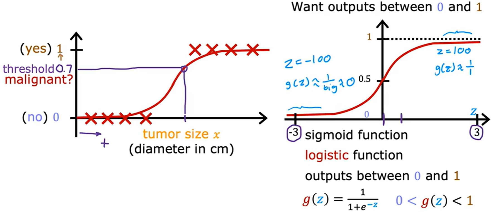

> Sigmoid函数，又称logistic函数，是最早使用的激活函数之一。但是由于其固有存在的一些缺点，如今很少将其作为激活函数，但是依然常用于二分类问题中的概率划分。

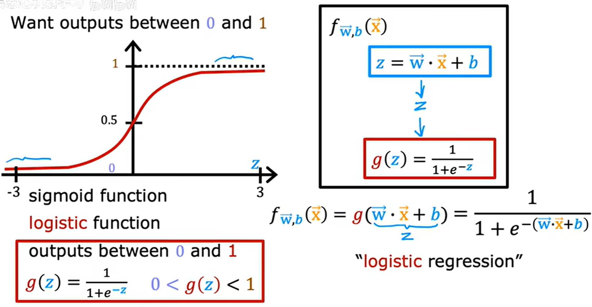

**将线性回归的结果，通过sigmoid函数转换到0-1的范围，实现分类。**

### 逻辑回归的解释

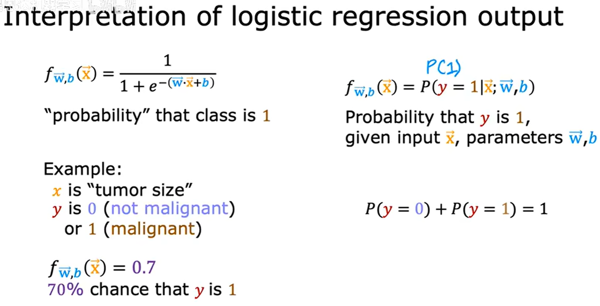

$$
f_{\vec{w}, b}(\vec{x}) = P(y = 1|\vec{x};\vec{w},b)
$$
表示为给定输入特征为 $x$，$y$ 等于 $1$ 的概率。

(given x, and with parameters w and b)

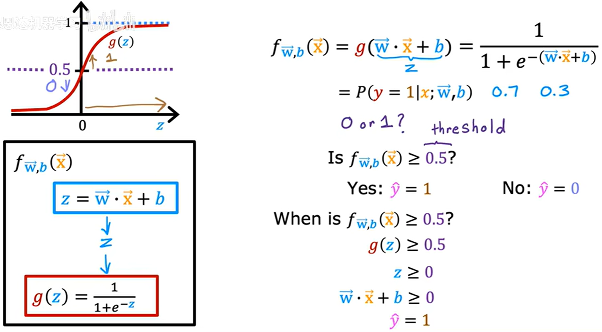

> threshold 阈值

通过与阈值进行比较来决定 $\hat{y}$ 为 $0$ 还是 $1$，通常将 $0.5$ 作为阈值。

### 决策边界 (Decision boundary)

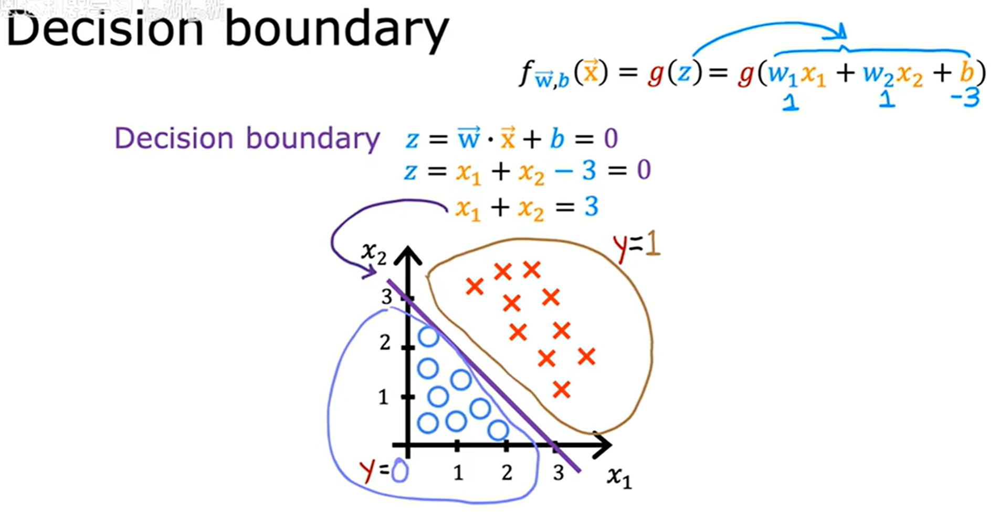

决策边界便是让 $z = 0$ 的地方，在这里设 $\vec{w} = [1, 1]$，由此令 $z = 0$，则 $x_1 + x _ 2 = 3$，在这个例子中通过线性规划可以做出对应的直线，如上图所示。

决策边界也不一定是直线，通过前面学过的多项式回归，可以得到下图关系。

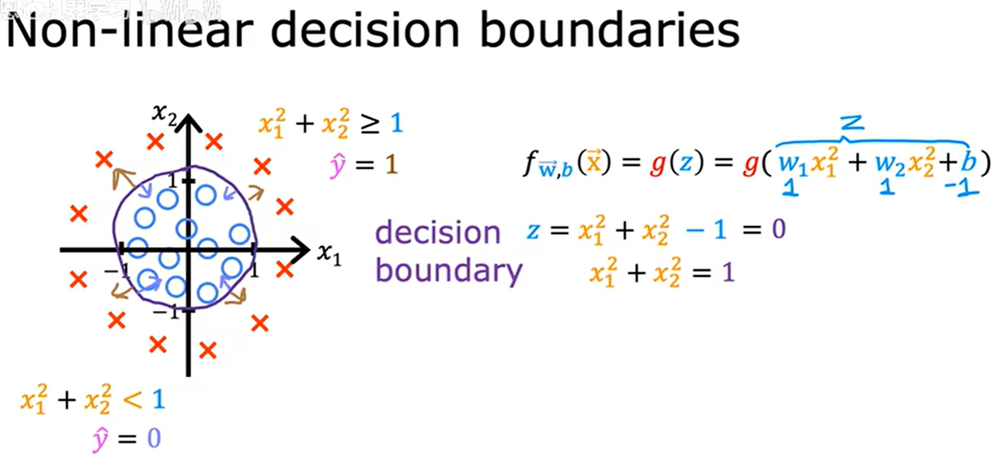

先通过梯度下降算法对样本拟合出曲线或者曲面或者更高纬度，然后对其进行分类。

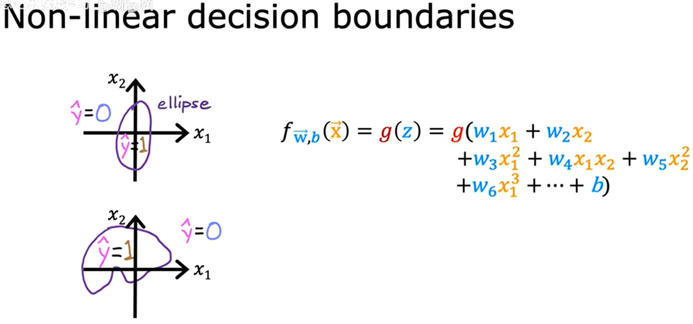

通过多项式特征，可以获得非常复杂的决策边界，换句话说逻辑回归可以拟合非常复杂的数据。

### 逻辑回归的代价函数

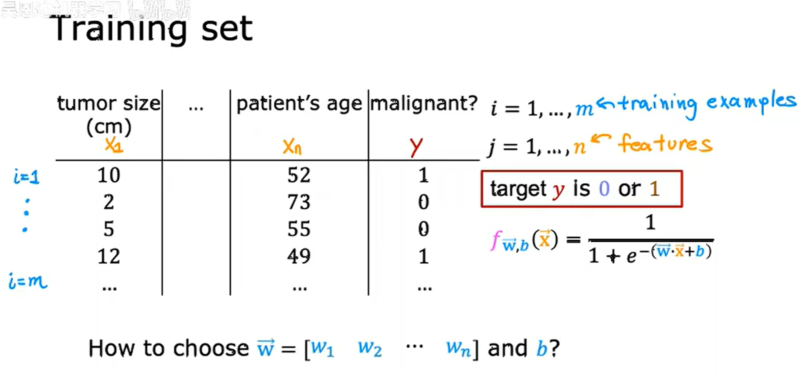

线性回归中，通过平方误差作为代价函数来决定 $\vec{w}$ 和 $b$ 的取值，同理逻辑回归也可以去寻找对应的代价函数来决定 $\vec{w}$ 和 $b$ 的取值。

> convex function 下凸函数
>
> concave function 上凸函数

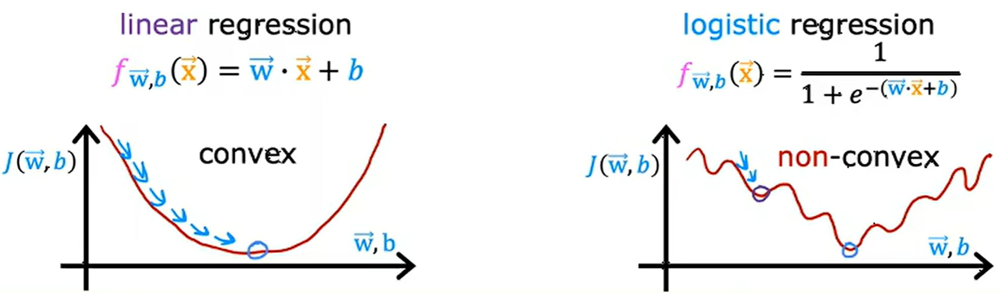

如果同样使用前面平方误差作为代价函数的话，从上图结果来看，这将导致代价函数为非下凸函数 （non-convex function），使用梯度下降会导致很容易陷入局部最小值，而非全局最小值。因此，平方误差代价函数对于逻辑回归并不是一个好的选择。

将以下符号称为单个训练实例的损失 (loss)。
$$
L(f_{\vec{w}, b}(\vec{x}^{(i)}), y^{(i)})
$$

例如，在之前学到的线性回归中，代价函数形式如下。
$$
J(w, b) = \frac{1}{2m} \sum_{i=1}^m (\hat y^{(i)} - y^{(i)}) ^ 2
$$

因此单个训练实例的损失定义如下。($\frac{1}{2}$ 要提到内部单项)
$$
L(f_{\vec{w}, b}(\vec{x}^{(i)}), y^{(i)}) = \frac{1}{2}(f_{\vec{w}, b}(\vec{x}^{(i)}) - \vec{y}^{(i)})
$$

另外可以得到，以下定义。
$$
J(w, b) = \frac{1}{m} \sum_{i = 1}^{m}L(f_{\vec{w}, b}(\vec{x}^{(i)}), y^{(i)})
$$

**这里选用以下函数作为逻辑回归的代价函数，个人感觉是一种针对sigmoid函数的 $e^x$ 的特殊构造。（不到怎么推出来的，问就是前人的智慧😂）**
$$
L(f_{\vec{w}, b}(\vec{x}^{(i)}), y^{(i)}) = 
\begin{cases}
-\log(f_{\vec{w}, b}(\vec{x}^{(i)})) &if \quad y^{(i)} = 1\\
-\log (1 - f_{\vec{w}, b}(x^{(i)})) &if \quad y^{(i)} = 0
\end{cases}
$$

**称为二分类交叉熵损失（Binary Cross-Entropy, BCE）**

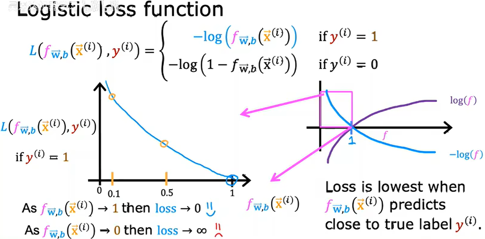

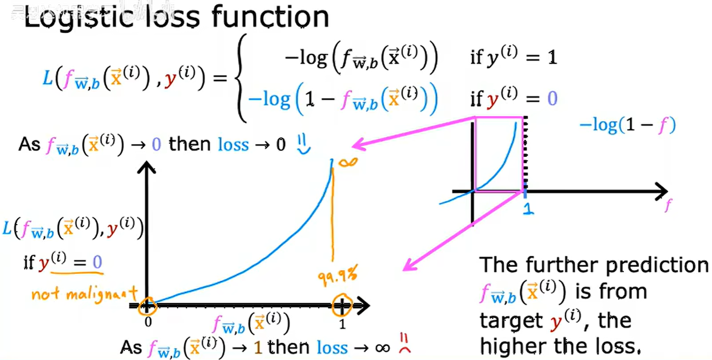

如果模型预测 99.9% 的概率为恶性肿瘤，但是结果为非恶性肿瘤，loss 就会非常高用来惩罚模型。

> 用原来的平方和的损失函数导致在逻辑回归情况下，函数是非凹非凸的，会落入局部最小值。两个拆开的凸函数达到局部最优，也就是整体的全局最优，而改用为这个，把逻辑回归分为训练事例 $y$ 的真实值为 $0$，为 $1$，依据log形成两个拆开的凸函数。

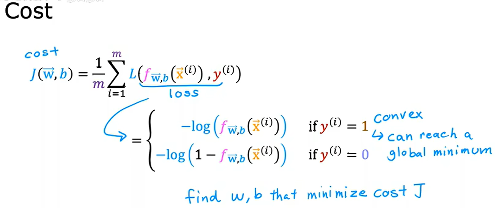

事实证明选择这个损失函数，整体函数为下凸函数 (convex function)，这个构型是高斯误差方程。

### 机器学习中代价函数的设计

#### 1. 代价函数的来源

##### （1）从概率模型推导而来（统计学习视角）

- **核心思想**：假设数据服从某种概率分布，通过**极大似然估计（MLE）** 或 **最大后验估计（MAP）** 推导出损失函数。
- **典型例子**：
	- **均方误差（MSE）**：假设噪声服从高斯分布（线性回归）。
	- **交叉熵损失**：假设标签服从伯努利/多项分布（逻辑回归、Softmax分类）。
	- **泊松损失**：假设数据服从泊松分布（计数数据回归）。
- **为什么有效**：
	这类损失函数天然具备概率解释，优化它们等价于最大化数据似然或后验概率。

##### （2）直接针对算法目标设计（优化视角）

- **核心思想**：不依赖概率假设，而是直接定义优化目标（如间隔最大化、稀疏性等）。
- **典型例子**：
	- **Hinge Loss（SVM）**：目标是最大化分类间隔，无显式概率模型。
	- **0-1损失**：直接优化分类错误率（但不可导，实际常用替代损失）。
	- **自定义损失**：如Focal Loss（解决类别不平衡）、Huber Loss（鲁棒回归）。
- **为什么有效**：
	这些函数直接反映算法的核心目标（如分类准确性、鲁棒性），即使没有概率解释。

------

#### 2. 代价函数与算法的适配性

不同算法使用不同的代价函数，因为它们的**目标**和**假设**不同：

| **算法**          | **典型代价函数**     | **设计依据**               |
| :---------------- | :------------------- | :------------------------- |
| 线性回归          | 均方误差（MSE）      | 高斯噪声假设 + MLE         |
| 逻辑回归          | 交叉熵损失           | 伯努利分布 + MLE           |
| 支持向量机（SVM） | Hinge Loss           | 最大化分类间隔（几何目标） |
| 决策树            | 基尼系数/信息增益    | 分割纯度的直接度量         |
| 神经网络          | 多种（MSE/交叉熵等） | 根据任务选择（回归/分类）  |

#### 总结

- **回归问题**：常用MSE（高斯假设）、MAE（拉普拉斯假设）、Huber Loss（鲁棒性）。
- **分类问题**：常用交叉熵（概率校准）、Hinge Loss（间隔最大化）。
- **特定需求**：如类别不平衡用Focal Loss，稀疏性用L1正则。

### 逻辑回归的简化代价函数

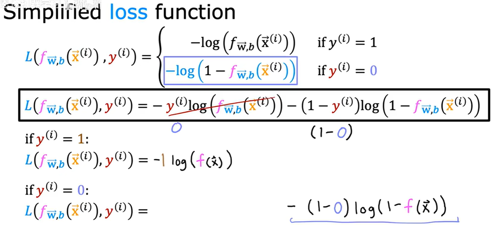

合并二分类交叉熵损失（Binary Cross-Entropy, BCE）

$$
L(f_{\vec{w}, b}(\vec{x}^{(i)}), y^{(i)}) = -y ^{(i)} \log(f_{\vec{w}, b}(\vec{x}^{(i)}))
- (1 - y ^{(i)}) \log (1 - f_{\vec{w}, b}(x^{(i)}))
$$

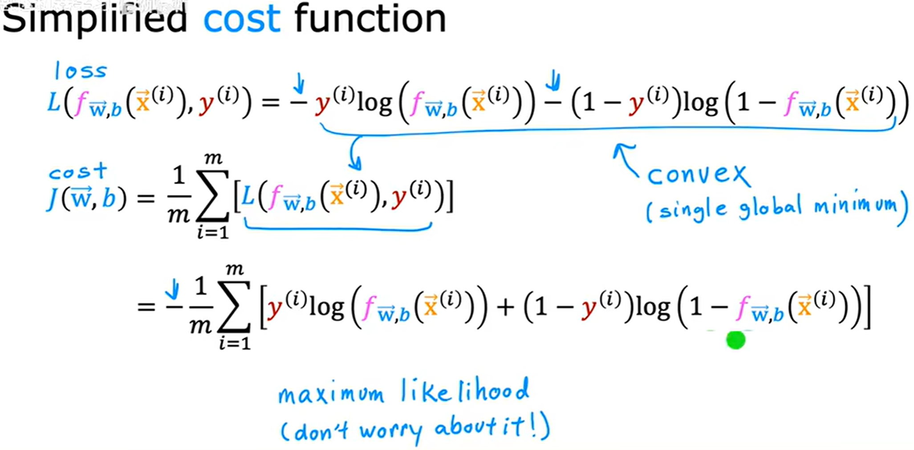

### 梯度下降实现

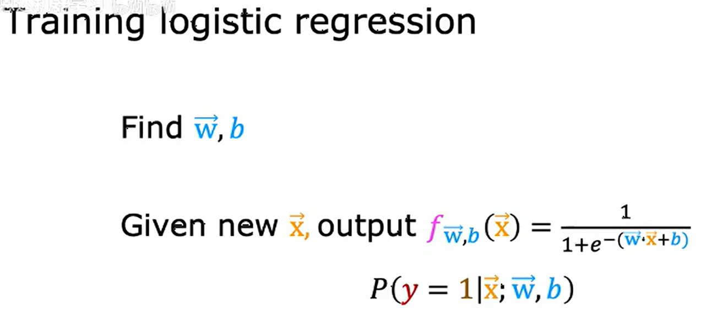

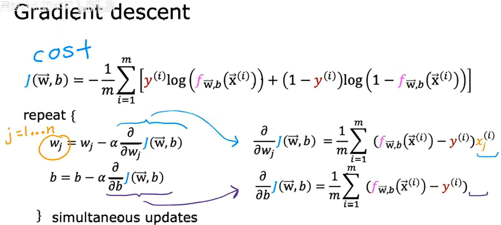

上述求导中，将 $\log$ 默认看为了 $\ln$ 然后进行。

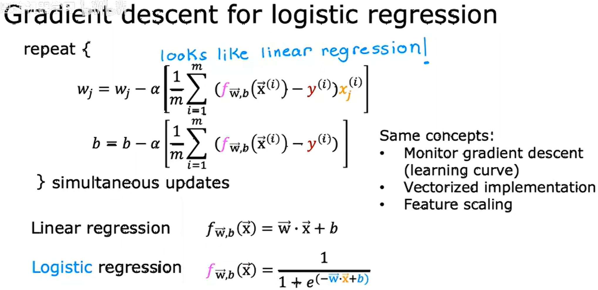

上述形式看起来很像线性回归所求的，但是注意 $f_{\vec{w}, b}(\vec{x}^{(i)})$ 已经发生了改变。

## 欠拟合和过拟合

### 多种拟合表现

>过拟合: Overfitting
>
>欠拟合: Underfitting
>
>泛化: Generalization

#### 回归 (Regression)

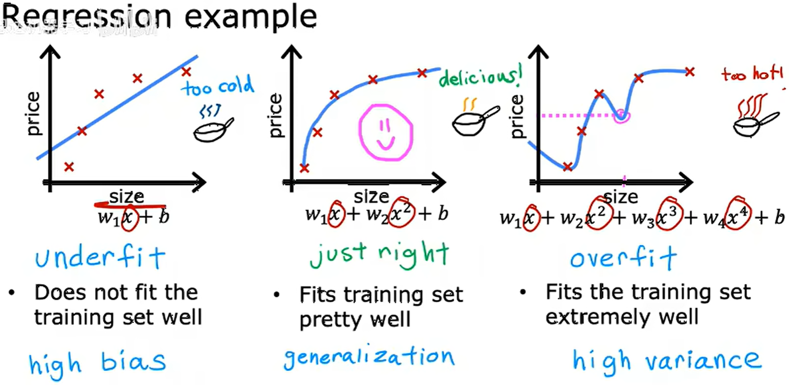

如上第一张图所示，模型拟合效果不好，通常称为**欠拟合** (Underfitting)，另一种称呼为 **高偏差** (High Bias)。通常因为预设偏差，导致认为数据是线性的预设使其拟合了一条与数据不符合的直线。

如上第二张图所示，模型拟合效果很好，可以在不属于训练集的例子上也是如此，这种就叫做**泛化** (Generalization)。

如上第三张图所示，模型在拟合训练数据上做得非常好，完美通过所有训练数据，使误差为 $0$，但是其图像表现的抖动异常，甚至预测出房子更大，其价格甚至更低。这种就叫做**过拟合** (Overfitting)，也称为**高方差** (High variance)，完美拟合的是已知的训练数据集，当拿着新的数据过来使用这个模型，可能因为数据随机落在曲里拐弯儿的地方模型造成较大程度的预测错误，不稳定性太高，其泛化能力差，不能推广至不属于训练集的例子上。

#### 分类 (Classification)

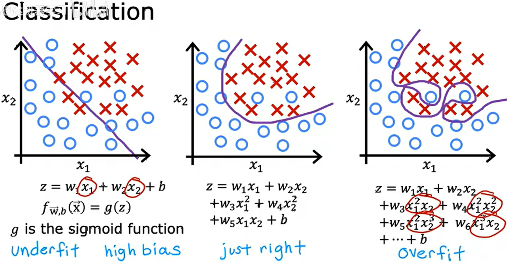

### 解决过拟合的方法

**收集更多训练样本**

随着样本数量增加，学习算法能够更好地捕捉数据的真实规律，从而学习到一个更加平滑、泛化能力更强的函数。这种情况下，模型可以尝试拟合更复杂的假设空间（如高阶多项式或高维特征空间），而不会产生过度的波动或过拟合现象。这是因为更大的训练集提供了更充分的统计信息，使得算法能够有效区分数据中的真实模式与随机噪声。

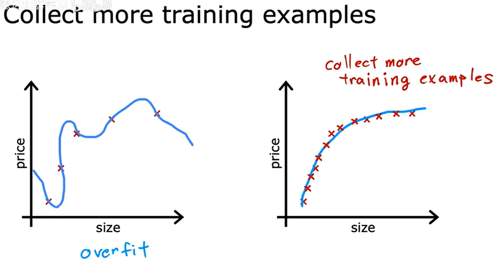

**特征选择 (Feature Selection)**

通过减少特征来降低模型复杂度，以防止过拟合。

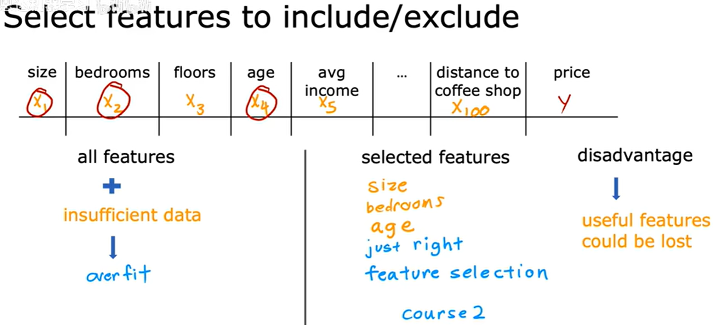

**正则化 (Regularization)**

正则化（Regularization）与特征选择（Feature Selection）在目标上类似，都是通过降低模型复杂度来防止过拟合，但两者的机制不同：

- **特征选择** 是直接剔除不相关或冗余的特征（如通过统计检验、L1正则化或递归特征消除），从而减少输入维度。
- **正则化** 则通过约束模型参数的取值（如L2正则化使权重接近但不等于0，L1正则化使部分权重归零），**间接调整特征的影响**，而非完全去除它们。

**关键区别**：

1. **特征选择** 是“硬性剔除”，可能丢失部分信息，但可提高可解释性。
2. **正则化** 是“柔性抑制”，保留所有特征但限制其贡献，更适合特征间存在相关性或数据稀缺的场景。

例如：

- L1正则化（Lasso）可视为**嵌入式的特征选择**（部分权重归零）。
- L2正则化（Ridge）则更温和，仅缩小权重，适合需要保留所有特征的场景（如医学数据分析）。

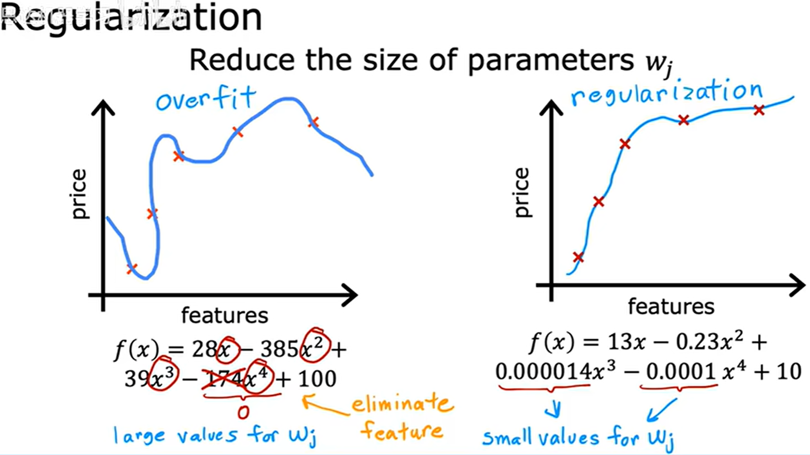

> 通常只改变参数 $\vec{w}$ 的值，正则化参数 $b$ 的作用并不大，不鼓励将 $b$ 变得很小。

**总结**

> 本质上是数据点数量（样本量）与模型参数数量（复杂度）之间的平衡问题。

- **参数过多 + 样本过少** → 模型容易记住噪声（过拟合）。
- **参数合理 + 样本充足** → 模型能学到真实规律（泛化性好）。

**数学体现**：

- 模型的**自由度**（参数数量）决定了其拟合能力，而**数据量**决定了统计可靠性。
- 例如，用高阶多项式拟合少量数据点，几乎可以完美拟合（过拟合），但泛化性极差。

**解决过拟合的两种核心思路**

**(1) 增加数据量（更根本的解决方案）**

- **更多数据**提供更强的统计约束，使复杂模型也能学到稳定模式。
- 但现实中数据获取可能成本高（如医学实验）。

**(2) 控制参数数量或影响（正则化、特征选择等）**

- **减少参数数量**：特征选择、降维（PCA）、简化模型结构（如用线性模型代替神经网络）。
- **约束参数取值**：正则化（L1/L2）、早停法（Early Stopping）、Dropout（神经网络）。

### 正则化代价函数

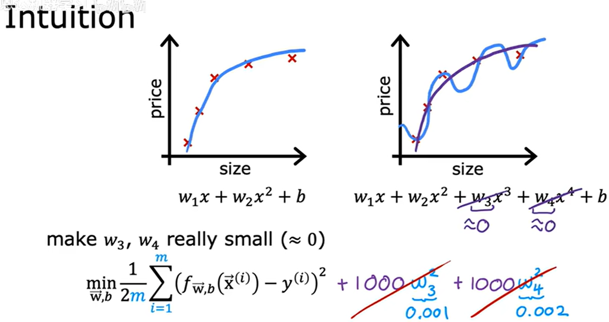

通过修改代价函数，在原代价函数上**额外添加惩罚项**。

如上图所示，添加的两个惩罚项，使得模型会因为 $w_2、w_3$ 大小而受到惩罚，模型在优化时会倾向于**减小这些权重的绝对值** ，从而几乎消除了对应的 $x^3、x^4$ 特征值的影响，如图中拟合会更接近于二次函数。

由于不知道哪些是最重要的特征，也不知道该惩罚哪些特征，所以正则化通常是对所有特征进行惩罚，即惩罚所有 $w_j$ 参数。

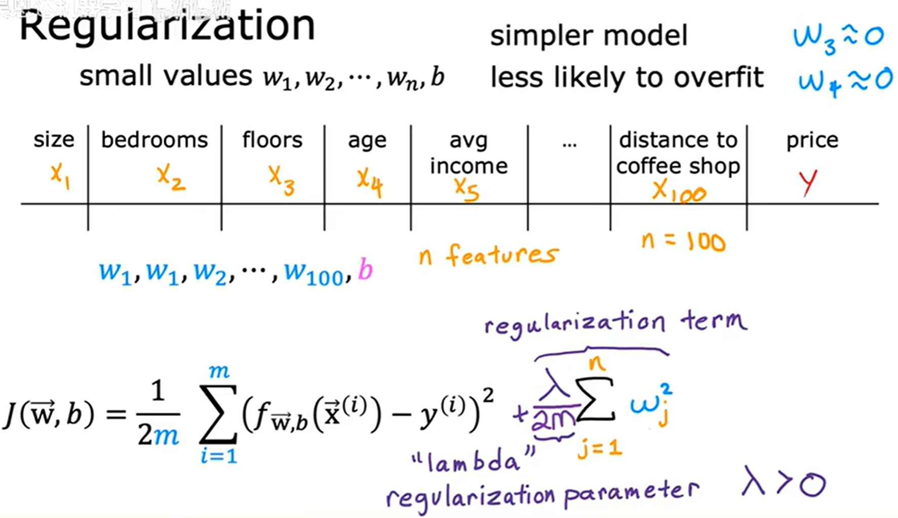
$$
J(w, b) = \frac{1}{2m} \sum_{i=1}^m (\hat y^{(i)} - y^{(i)}) ^ 2 + \frac{λ}{2m}\sum_{j=1}^nw_j^2
$$
同时对两项都进行 $\frac{1}{2m}$ 缩放，对选择一个合适的 $λ$ 值会更容易。例如，训练集增大导致 $m$ 增大，由于缩放使得先前的 $λ$ 更有可能工作。

有些会有 $b$ 的惩罚项，但其效果微小，可以不使用。

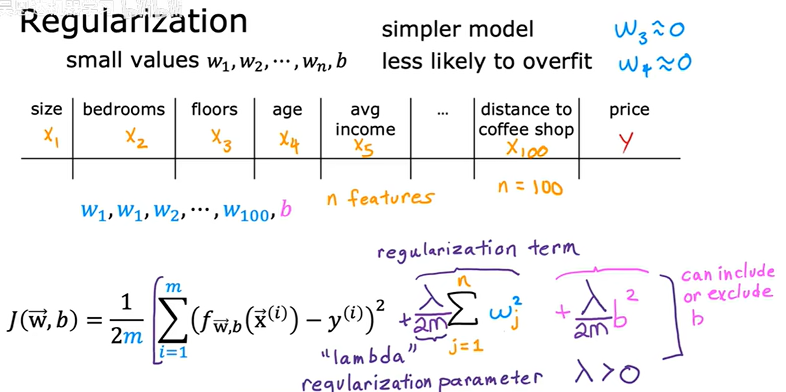

$λ$ 值指定了相对重要性，权衡两项。

> 当 $λ = 0$，就会完全没有使用正则化项，最终可能会出现过拟合的情况；
>
> 当 $λ$ 取的非常非常大，例如 $λ = 10^{10}$，会导致权值特别小，最后欠拟合。

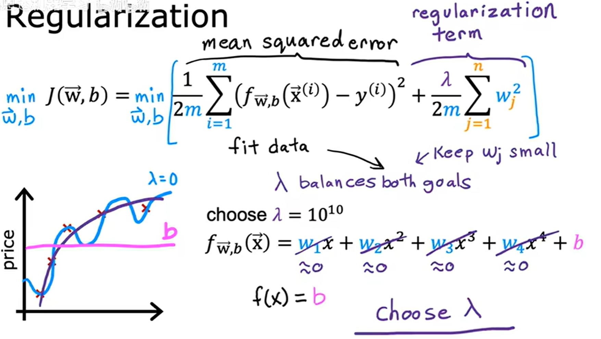

### 正则化线性回归 (Regularized linear regression)

梯度下降公式推导

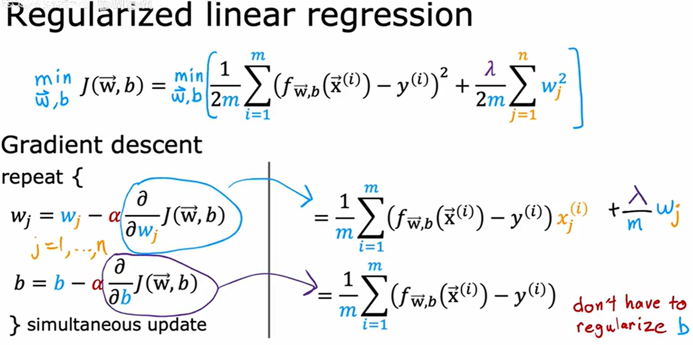

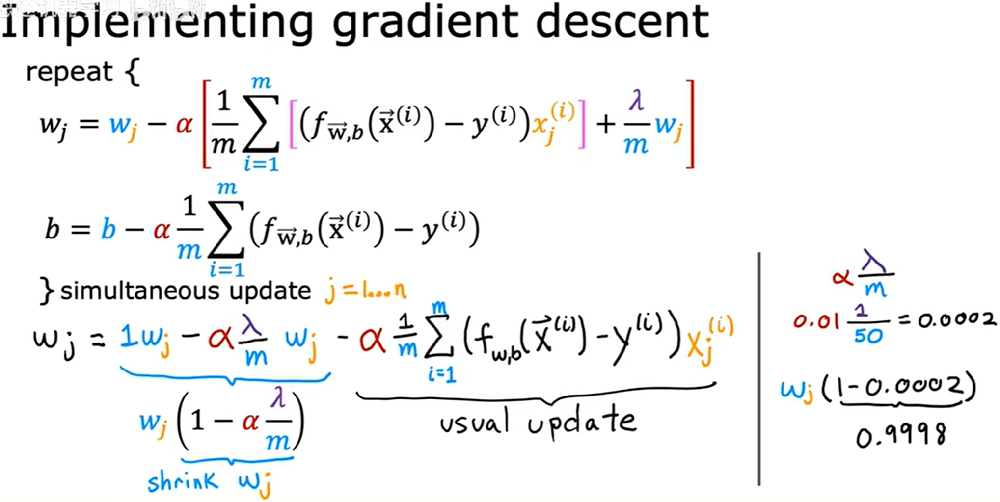

加入正则化后，让 $w_j$ 每回先变为原来的 $1 - α\frac{λ}{m}$ 倍后再进行正常的梯度下降更新，这也是正则化能会在每次迭代中稍微缩小参数 $w_j$ 的工作原理。

### 正则化逻辑回归 (Regularized logistic regression)

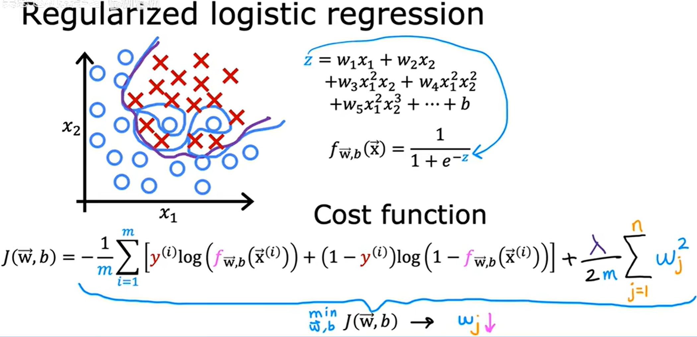

和线性回归相似，加上惩罚项。

计算导数

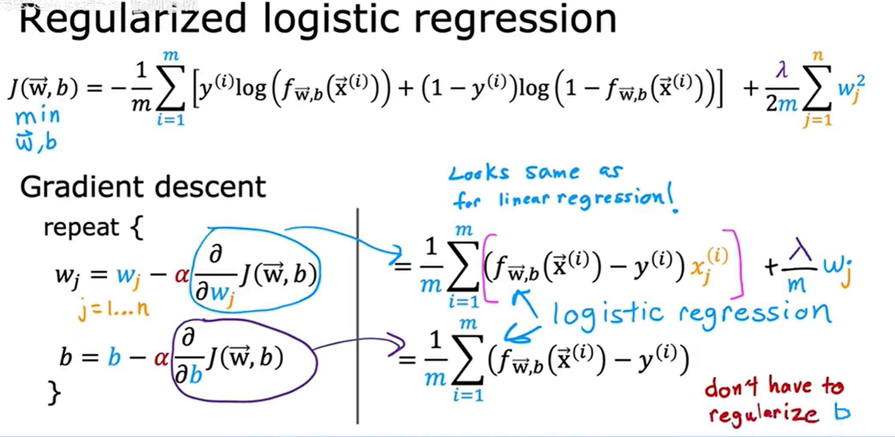
